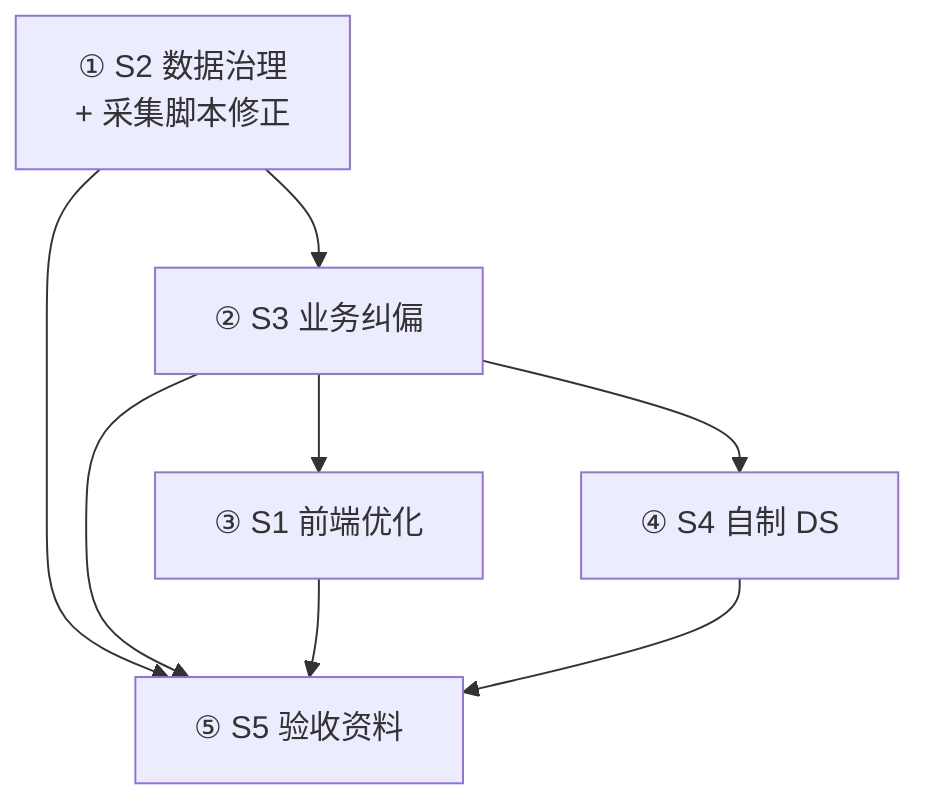

# 验收冲刺项登记（待拍板）

> **用途**：记录收尾冲刺的五类工作及其**依赖顺序**；具体方案与实施细节**待负责人逐条给出需求后再定**。
> **状态**：`登记中` — 负责人已给出**优先级/难易排序**与 S2 方向；具体实施待分条需求。
> **基线**：`main` @ `74a2e03`（2026-06-08）

---

## 1. 冲刺项一览（负责人优先级排序）

| 顺序 | ID | 主题 | 负责人理解（难易/先后） | 状态 |
|------|-----|------|-------------------------|------|
| **①** | **S2** | 展示数据治理 | **最好做、最先做**；见 §2 | 方向已明确，待 OSM 包清单与脚本修正 |
| **②** | **S3** | 业务功能纠偏 | 需求错位项待逐条给出 | 待需求 |
| **③** | **S1** | 前端导航与视觉 | 在数据与业务口径稳定后再改 | 待需求 |
| **④** | **S4** | 自制数据结构 | 课程硬约束，范围待指示 | 待需求 |
| **⑤** | **S5** | 验收参考资料 | **最后**定稿（依赖前几项结果） | 待需求 |

---

## 2. S2 数据治理 — 已对齐的方向（待执行）

### 2.1 原则

1. **`osm-data` 为业务真源**：景区、POI、道路、设施（修正后）、室内图均来自 OSM 采集管线。
2. **dev-seed 瘦身**：除**用户相关**外，删除早期测试用假数据（景区、POI、道路、日记、评价、美食、设施等）。
   - **保留候选**：`users.json`、`user_interests.json`（及鉴权演示所需最小集）。
   - **删除/清空候选**：`scenic_areas`、`buildings`、`roads`、`facilities`、`foods`、`restaurants`、`diaries`、`comments`、`diary_destinations`、`tags` 等业务假数据（以负责人最终清单为准）。
3. **衍生数据后置**：日记、美食、设施等**手工/种子补充**，须在**确定保留哪些 osm-data 包之后**再写，且与真源景区 ID 对齐。
4. **运行模式倾向**：答辩以 **JSON + 内存** 为主，可考虑完全弃用 MySQL 连接（配置层待 S2 实施时固化）。

### 2.2 S2 子任务：采集脚本缺口（阻塞真源质量）

负责人指出当前 **OSM 抓取与需求口径不匹配**，需在选定 osm-data 包之前或并行修正脚本：

#### A. 服务设施（`facilities`）筛选不足

| 需求口径（FR-006） | 当前脚本行为（`osm_seed.py`） | 缺口 |
|--------------------|-------------------------------|------|
| 商店、饭店、洗手间、图书馆、食堂、超市、咖啡馆等作为**设施**查询 | `classify_facility()` 仅覆盖 toilet / hospital / bike / service / printer 等少量 `amenity` | 超市、`shop=chemist/supermarket`、`amenity=cafe` 等**未进 facilities** |
| 设施与 POI 分工 | 图书馆、餐厅、商店等多被 `classify_poi()` 写入 **POI/buildings**，而非 `facilities.append.json` | 前端「设施查询」数据源与需求语义不一致 |
| 设施种类 ≥10 | 合并后仅 **6** 种 | 种类数不达标，根因在标签映射与分流逻辑 |

**待办（登记）**：扩展 `classify_facility` / OSM tag 映射；明确「设施 vs 可路线 POI」分流规则；与 `poi-types.json`、后端 `FacilityService` 对齐。

#### B. 室内数据（`indoor`）过严丢弃

| 现象 | 可能原因（待验证） |
|------|-------------------|
| `latest/indoor/rejected/*.json` 大量存在 | `indoor_seed.evaluate_completeness()`：≥2 room、≥3 corridor、walkable 连通等门禁过严 |
| 负责人判断 raw Overpass **含丰富室内要素** | 房间 way 质心、MST 合成走廊、竖向边等启发式仍不足以让 bundle 过关 |
| 仅少数 POI `indoorAvailable=true` | 与需求「OSM 有数据则应尽量利用」不符 |

**待办（登记）**：审计 rejected 原因分布；放宽或分级完整度（演示级 vs 严格级）；改进从 `raw/overpass.json` 抽室内特征的逻辑。

### 2.3 OSM 包策略（负责人 2026-06-08 拍板）

| 项 | 决策 |
|----|------|
| 现有 `osm-data` | **均可弃用**（抓取逻辑将重做，旧包不保留为真源） |
| **迭代沙箱（暂留）** | 仅保留 **北邮沙河校区** 一包，用于自动化验证脚本： `osm-data/北京邮电大学-沙河校区-南丰路-沙河镇-昌平区-北京市-102206-中国/` |
| 其余 OSM 包 | 数据治理阶段删除（师大北路、执信、贵阳一中等） |
| 衍生 seed | 脚本验证通过、重抓沙河包达标后，再清 dev-seed 假数据并更新 `map-imports.json` |

### 2.4 S2 执行顺序与脚本迭代闭环

**迭代验收（自行设计，以北邮沙河为固定样本）**：

1. 跑室外采集 → 检查 `pois` / `facilities` 种类与数量（商店、饭店、洗手间、图书馆、食堂、超市、咖啡馆等是否进入 **facilities**）。
2. 跑室内采集 → 统计 `indoor/` 通过 vs `rejected/` 及原因；目标减少误杀、提高 `indoorAvailable` 命中。
3. `python scripts/validate_osm_output.py`（或等价检查）+ 后端加载 smoke（`dev` profile 启动后 `map-data` / `facility/search` / `indoor/buildings`）。
4. 未达标则回到步骤 1 改脚本，**不**提前清 dev-seed 或删沙河沙箱数据。

---

## 3. 依赖关系（与负责人优先级一致）

| 关系 | 说明 |
|------|------|
| **S2 → S3** | 设施/室内/景区真源决定功能验收样本 |
| **S3 → S1** | 纠偏后的功能边界决定导航与页面 |
| **S2 → S1** | 演示路径依赖最终 osm-data 包 |
| **S3/S4 → S5** | 文档须反映最终功能与数据结构 |
| **S5 最后** | README/算法说明/启动流程依赖前几项定稿 |

**当前共识**：按 **S2 → S3 → S1 → S4 → S5** 推进；S2 内**先修采集脚本再定包再清 seed**；分项具体需求仍由负责人后续给出。

---

## 4. 各冲刺项待澄清项（占位，供后续填入）

### S1 前端导航与视觉
- [ ] 一级导航最终中文文案
- [ ] 二级导航是否调整
- [ ] 视觉问题清单（由负责人逐条指出）

### S2 展示数据治理
- [x] 方向：dev-seed 仅保留用户相关；osm-data 为唯一业务真源；衍生数据后置
- [ ] 设施脚本：`classify_facility` 扩展（商店/饭店/洗手间/图书馆/食堂/超市/咖啡馆等）
- [ ] 室内脚本：rejected 审计 + 完整度/特征抽取修正
- [x] OSM 沙箱：暂留北邮沙河（南丰路）；其余包待治理阶段删除
- [ ] 沙河迭代验收脚本/检查表（自行设计）
- [ ] 是否彻底 JSON-only（不连 MySQL）
- [ ] dev-seed 删除文件最终清单
- [ ] `map-imports.json` 与清空后基线关系

### S3 需求与实现纠偏
- [ ] 错位 FR/页面/接口清单（负责人提供）
- [ ] 每项：改代码 vs 改需求文档

### S4 自制数据结构替换
- [ ] 替换范围（包/类列表，负责人指示）
- [ ] 答辩口径：哪些层可用 JDK、哪些必须用自制结构

### S5 验收参考资料
- [ ] 文档落点（根 README、`docs/验收/` 等）
- [ ] 算法说明深度与示例
- [ ] 与 S2/S3/S4 定稿后的同步时间点

---

## 5. 工作方式

1. 负责人在会话中给出**某冲刺项的具体需求**。
2. 评估是否影响已登记的其他项；必要时**调整 §2 依赖或顺序**。
3. 小步实施 → 验证 → 更新 `HANDOFF.md` 与本文件对应条目的状态。
4. **S5 验收资料**建议在 S2/S3/S1/S4 主体口径稳定后集中定稿（可边做边记素材）。

---

## 6. 变更记录

| 日期 | 说明 |
|------|------|
| 2026-06-08 | 初建：登记 S1–S5 与依赖关系；状态均为「待需求」，不拍板、不实施 |
| 2026-06-08 | 负责人优先级：**S2→S3→S1→S4→S5**；S2 明确 dev-seed 瘦身 + osm 真源；登记设施/室内采集缺口 |
| 2026-06-08 | S2 拍板：现有 osm-data 均可弃；**暂留北邮沙河** 作抓取迭代沙箱；闭环见 §2.4 |
