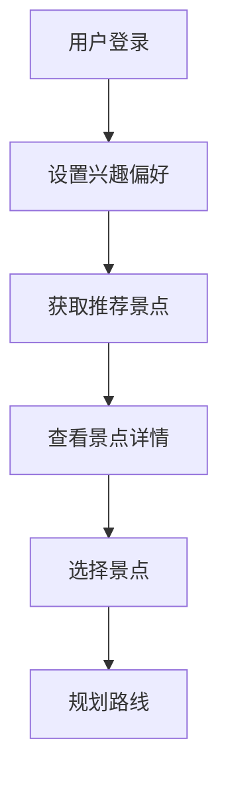
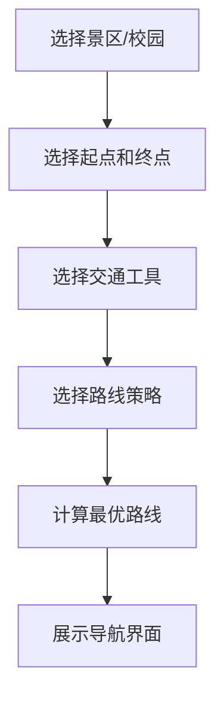
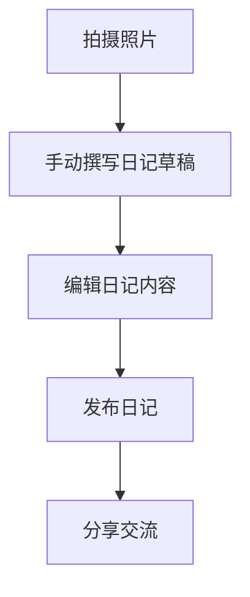

# 个性化旅游推荐系统需求规格说明书

## 1. 项目概述
### 1.1 项目背景
随着人们生活水平的提高，旅游已经成为人们休闲娱乐的重要方式。然而，面对众多的旅游景点和旅游信息，用户往往难以选择适合自己的旅游目的地，也难以在旅游过程中规划最优的参观线路。个性化旅游系统旨在帮助用户管理旅游活动，提供个性化的旅游推荐和线路规划服务，提升用户的旅游体验。

### 1.2 项目目标
开发一个个性化旅游系统，具备旅游地点推荐、旅游路线规划、旅游场所查询、旅游日记交流等功能，满足用户在旅游前、旅游中和旅游后的各种需求。

### 1.3 目标用户
| 角色 | 描述 | 核心职责 |
|------|------|----------|
| 普通用户 | 旅游爱好者 | 浏览推荐、规划路线、查询场所、撰写日记、分享交流 |
| 管理员 | 系统维护者 | 管理用户、景区信息、道路图、美食信息等 |

### 1.4 项目范围
本项目专注于个性化旅游服务，包括旅游目的地推荐、景区内线路规划、场所查询、旅游日记管理和美食推荐等功能。系统将覆盖景区和校园等多种旅游场景。

## 2. 功能需求
### 2.1 旅游前功能
#### 2.1.1 功能列表
| 功能编号 | 功能名称 | 优先级 | 描述 | 验收标准 |
|----------|----------|--------|------|----------|
| FR-001 | 旅游目的地推荐 | 高 | 根据旅游目的地的热度、评价和个人兴趣，为用户推荐合适的旅游目的地。个人兴趣类型包括：自然风光、历史文化、主题乐园、美食、购物、休闲娱乐等。系统通过用户兴趣与景点标签的匹配度进行量化计算。 | 系统能够根据热度、评价和个人兴趣推荐旅游目的地 |
| FR-002 | 目的地信息查询 | 高 | 提供旅游目的地的详细信息，包括景点介绍、开放时间、门票价格、交通信息、最佳游览时间、联系方式等。 | 系统能够提供旅游目的地的详细信息 |
| FR-003 | 个人兴趣设置 | 中 | 用户可以设置个人兴趣偏好，系统根据偏好进行推荐。用户可以选择多个兴趣类型，并设置各兴趣类型的权重。 | 用户能够设置个人兴趣偏好，系统根据偏好进行推荐 |

### 2.2 旅游中功能
#### 2.2.1 旅游路线规划
| 功能编号 | 功能名称 | 优先级 | 描述 | 验收标准 |
|----------|----------|--------|------|----------|
| FR-004 | 最优参观线路规划 | 高 | 在景区（包括校园）内部根据游览目标规划最优的参观线路。最优线路的评价标准包括：距离最短、时间最短、景点覆盖最多等，用户可以选择优先考虑的因素。 | 系统能够在景区内部规划最优的参观线路 |
| FR-004-1 | 最短距离策略 | 高 | 规划距离最短的线路 | 系统能够实现最短距离策略的线路规划 |
| FR-004-2 | 最短时间策略 | 高 | 考虑道路拥挤度的情况下规划时间最短线路。道路拥挤度采用“按交通工具划分”的结构化数据（如 walk/bike/shuttle 对应各自拥挤度），取值范围为 [0,1]。真实速度=交通工具基础速度与道路理想速度约束后的速度 × 对应交通工具拥挤度。由于无法实时获取真实拥堵，本系统在生成路网数据时为每条道路的每种可通行交通工具随机生成 0~1 的模拟拥挤度。 | 系统能够实现基于交通工具维度拥挤度的最短时间策略 |
| FR-004-3 | 交通工具的最短时间策略 | 中 | 校区内可选择自行车和步行，景区内可选择步行和电瓶车。每条道路可允许多种交通工具通行，并为每种交通工具配置独立拥挤度。路径规划时需严格按所选交通工具过滤可通行道路；前端在用户选中规划路径后，需可查看路径上道路允许通行的交通工具类型及对应拥挤度。步行速度为4km/h，自行车速度为12km/h，电瓶车速度为20km/h。 | 系统能够实现不同交通工具的最短时间策略，并在路径结果中展示道路可通行交通工具及对应拥挤度 |
| FR-004-4 | 导航功能的图形界面 | 中 | 设计包括地图展示和输出路径展示的导航界面。地图数据使用离线地图包，支持基本的导航功能。 | 系统能够展示导航功能的图形界面 |

#### 2.2.2 场所查询
| 功能编号 | 功能名称 | 优先级 | 描述 | 验收标准 |
|----------|----------|--------|------|----------|
| FR-005 | 景点介绍 | 高 | 提供景区内各个景点的详细介绍和相关信息 | 系统能够提供景点的详细介绍 |
| FR-006 | 场所查询 | 高 | 提供景区内各种服务设施的查询功能，如商店、饭店、洗手间等 | 系统能够查询景区内的各种服务设施 |
| FR-006-1 | 附近设施查找 | 高 | 找出附近500米范围内的超市、卫生间等设施，并根据实际可达路径距离进行排序。用户可以调整搜索范围（200米、500米、1000米）。 | 系统能够找出附近设施并根据实际可达路径距离排序 |
| FR-006-2 | 类别过滤 | 中 | 通过选择类别对查询结果进行过滤 | 系统能够通过类别过滤查询结果 |
| FR-006-3 | 类别名称查询 | 中 | 用户输入类别名称查找某个地点附近的服务设施，并根据实际可达路径距离进行排序。类别名称支持模糊匹配，系统会返回相似度高的结果。 | 系统能够根据类别名称查找附近服务设施 |

#### 2.2.3 美食推荐
| 功能编号 | 功能名称 | 优先级 | 描述 | 验收标准 |
|----------|----------|--------|------|----------|
| FR-013 | 美食推荐 | 高 | 在选中游览景点和学校后，推荐附近1000米范围内的美食。系统会考虑用户的饮食偏好（如辣度、口味等）。 | 系统能够推荐附近的美食 |
| FR-013-1 | 美食排序 | 高 | 按照用户选择的热度、评价和距离进行排序，要求不经过完全排序可以排好前10的美食。热度、评价和距离的权重默认分别为0.3、0.5、0.2，用户可以调整权重。 | 系统能够按照热度、评价和距离排序美食，不经过完全排序可以排好前10的美食 |
| FR-013-2 | 菜系过滤 | 中 | 根据菜系进行过滤 | 系统能够根据菜系过滤美食 |
| FR-013-3 | 模糊查询 | 中 | 输入美食名称、菜系、饭店或窗口名称等进行基于内容的模糊查询，支持部分匹配和同义词。 | 系统能够进行基于内容的模糊查询 |
| FR-013-4 | 查询结果排序 | 中 | 对查询结果按照热度、评价和距离进行排序 | 系统能够对查询结果按照热度、评价和距离排序 |

### 2.3 旅游后功能
#### 2.3.1 旅游日记管理
| 功能编号 | 功能名称 | 优先级 | 描述 | 验收标准 |
|----------|----------|--------|------|----------|
| FR-007 | 旅游日记生成 | 中 | 用户手动生成旅游日记，可填写标题、正文，并上传图片/视频或关联目的地信息。 | 用户能够手动生成旅游日记 |
| FR-008 | 旅游日记管理 | 高 | 用户可以查看、编辑和管理自己的旅游日记 | 用户能够查看、编辑和管理自己的旅游日记 |
| FR-008-1 | 日记撰写 | 高 | 用户可以通过文字、图片和视频等方式记录旅游内容。支持的图片格式包括JPG、PNG，视频格式包括MP4，单文件大小限制为10MB。 | 用户能够通过文字、图片和视频撰写日记 |
| FR-008-2 | 统一管理 | 中 | 对所有用户的旅游日记进行统一管理 | 系统能够对所有用户的旅游日记进行统一管理 |
| FR-008-3 | 日记浏览和查询 | 高 | 用户可以浏览和查询所有用户的旅游日记 | 用户能够浏览和查询所有用户的旅游日记 |
| FR-008-4 | 日记热度计算 | 中 | 旅游日记的热度按浏览次数计算，权重固定为1.0（每次有效浏览+1，不做近期加权）。 | 系统能够计算旅游日记的热度 |
| FR-008-5 | 日记评分 | 中 | 用户可以对旅游日记进行评分（1-5星） | 用户能够对旅游日记进行评分 |
| FR-008-6 | 日记推荐 | 中 | 按照日记热度、评价和个人兴趣进行推荐，推荐算法基础为排序算法 | 系统能够按照热度、评价和个人兴趣推荐日记 |

#### 2.3.2 旅游日记交流
| 功能编号 | 功能名称 | 优先级 | 描述 | 验收标准 |
|----------|----------|--------|------|----------|
| FR-009 | 旅游日记交流 | 高 | 用户可以分享和交流旅游日记，查看其他用户的旅游经历 | 用户能够分享和交流旅游日记 |
| FR-009-1 | 目的地相关日记查询 | 中 | 用户可以输入旅游目的地，对目的地相关的旅游日记根据热度和评分进行排序。相关性判断基于日记标题、内容和标签与目的地的匹配度。 | 用户能够查询目的地相关的旅游日记并排序 |
| FR-009-2 | 日记名称精确查询 | 中 | 用户可以输入旅游日记的名称进行精确查询，考虑日记数量较大、变化快的情况 | 用户能够通过名称精确查询旅游日记 |
| FR-009-3 | 全文检索 | 中 | 可以按日记内容进行全文检索 | 系统能够按日记内容进行全文检索 |
| FR-009-4 | 压缩存储 | 低 | 对旅游日记进行压缩存储 | 系统能够对旅游日记正文进行压缩存储，并在读取与检索时自动解码且不影响搜索结果 |
| FR-009-5 | 旅游动画生成 | 低 | 基于用户日记中的**文字与图片**，调用**第三方云端视频生成服务**（图生视频/文生视频等，由部署环境配置 API Key，不在浏览器暴露密钥）。提交任务时可选用画幅、风格、时长与补充提示词（未传项由服务端默认）；若对接会话型备用链路（LibTV），可在本站查看助手摘要并由用户追加消息直至成片。生成任务一般为异步；成片由服务端**下载落盘**后以本站静态资源 URL **与日记关联并持久化**（见 §2.3.3）。 | 用户能触发动画生成并可选参数；成功后可在日记中播放/查看本站持久链接；在 LibTV 场景下可与会话助手往返直至出片 |

#### 2.3.3 旅游动画持久化策略（策略 B，必选）

- **落盘位置**：服务端将厂商返回的视频文件下载至本地资源目录（与日记附件同一体系，例如 `data/media/video` 下单设的 `animation/` 或等价路径），通过 **`/media/**` 静态映射**对外提供访问。
- **日记关联**：数据库中为日记增加 **`animation_url`（或等价字段）** 存储本站相对/绝对可访问路径；**不以厂商临时 URL 作为唯一持久化依据**（避免链接过期导致日记失效）。
- **隐私与安全**：向云端提交的文本与图片均为用户日记内容，须在界面提示「内容由第三方服务处理」；API Key 仅置于服务端配置（环境变量/密钥管理）。

#### 2.3.4 可选云端服务商参考（免费/试用额度以官网为准）

> **说明**：视频生成多为按量计费；所谓「免费」通常为**新用户赠送额度、限时试用、学生计划或极低配额**，上线前请在厂商控制台核实余额与条款。下列仅为集成选型参考，**不构成背书**；接入时需验证 API 形态（异步任务、图生视频字段）与本系统字段是否匹配。

| 类型 | 参考方向 | 备注 |
|------|----------|------|
| 国内公有云 | **阿里云 DashScope（通义万相等）**、**腾讯云**、**火山引擎**、**百度智能云** | 常有试用金或短试用；需实名认证；文档与账单清晰，适合课程演示选用其一并完成端到端联调。 |
| 海外聚合/API | **Replicate**、**Hugging Face Inference** | 常见「注册赠少量额度」或低价按秒计费；适合已有国际支付或课程提供的账号；注意跨境延迟与内容审核。 |
| 需谨慎甄别 | 名称含「Free Veo API」等第三方聚合站 | 多为非官方封装，稳定性与合规风险较高，**不建议**作为课程唯一依赖。 |

### 2.4 系统管理功能
| 功能编号 | 功能名称 | 优先级 | 描述 | 验收标准 |
|----------|----------|--------|------|----------|
| FR-010 | 用户管理 | 高 | 管理系统用户信息，支持用户注册、登录等功能。用户角色包括普通用户和管理员，管理员具有系统配置和数据管理权限。 | 系统能够管理用户信息，支持用户注册、登录等功能 |
| FR-011 | 景区信息管理 | 高 | 管理景区和校园的基本信息，包括景点、POI和服务设施等 | 系统能够管理景区和校园的基本信息 |
| FR-012 | 道路图管理 | 高 | 管理景区和校园内部的道路图，包括POI和服务设施的位置信息 | 系统能够管理景区和校园内部的道路图 |
| FR-014 | 美食信息管理 | 中 | 管理景区和校园内的美食信息，包括名称、菜系、评价等 | 系统能够管理美食信息 |
| FR-015 | 系统通知 | 低 | 系统向用户发送推荐更新、活动通知等信息 | 系统能够向用户发送推荐更新、活动通知等信息 |
| FR-016 | 数据备份与恢复 | 高 | 定期备份系统数据，并提供数据恢复功能 | 系统能够定期备份数据，并提供数据恢复功能 |

## 3. 非功能需求
### 3.1 性能需求
- 系统响应时间应在3秒以内
- 线路规划算法计算时间应在2秒以内
- 全文检索响应时间应在1秒以内

### 3.2 安全需求
- 系统应实现数据加密存储
- 防止SQL注入和XSS攻击
- 保护用户隐私

### 3.3 可用性需求
- 界面设计应简洁美观
- 操作流程应直观易用
- 支持响应式设计，适配不同设备屏幕

### 3.4 兼容性需求
- 系统应兼容主流浏览器（Chrome、Firefox、Safari、Edge）
- 系统应兼容移动设备（iOS、Android）

### 3.5 可扩展性需求
- 系统应支持后续功能扩展和数据量增长
- 采用模块化设计，便于添加新功能

### 3.6 可维护性需求
- 代码应采用模块化设计，遵循编码规范
- 提供详细的文档和注释

### 3.7 可测试性需求
- 系统应提供完整的测试用例
- 支持单元测试和集成测试

### 3.8 创新性需求
- 系统的创新点体现在：1）结合多种排序算法实现高效的旅游推荐；2）使用图结构实现景区内最优路径规划；3）基于用户行为的个性化推荐；4）AIGC技术生成旅游动画。

### 3.9 算法要求
- 核心算法必须基于自己设计的数据结构，自己编程实现

### 3.10 系统要求
- 要求最终提供真实可用的系统

## 4. 业务流程图
### 4.1 旅游推荐流程

### 4.2 路线规划流程

### 4.3 旅游日记流程

## 5. 数据需求
### 5.1 数据实体
| 实体名称 | 描述 |
|---------|------|
| 用户 | 系统用户，包含基本信息和兴趣偏好 |
| 景区/校园 | 旅游目的地，包含基本信息和位置 |
| POI | 景区和校园内的兴趣点，如景点、教学楼、办公楼等 |
| 服务设施 | 景区和校园内的服务设施，如商店、饭店、洗手间等 |
| 道路图 | 景区和校园内部的道路网络，包含道路理想速度与“交通工具类型->拥挤度”的结构化配置 |
| 旅游日记 | 用户的旅游记录，包含照片、视频和文字描述 |
| 评价 | 用户对景点、服务和旅游日记的评价 |
| 交通工具 | 可用的交通工具类型和对应路线 |
| 美食 | 景区和校园内的美食信息，包含名称、菜系、评价等 |
| 饭店/窗口 | 提供美食的场所，包含名称、位置等信息 |

### 5.2 数据字典
| 实体 | 字段 | 类型 | 描述 |
|------|------|------|------|
| 用户 | id | BIGINT | 用户ID |
| 用户 | username | VARCHAR | 用户名 |
| 用户 | password | VARCHAR | 密码（加密存储） |
| 用户 | email | VARCHAR | 邮箱 |
| 景区/校园 | id | BIGINT | 景区ID |
| 景区/校园 | name | VARCHAR | 景区名称 |
| 景区/校园 | type | VARCHAR | 景区类型（普通景区、校园等） |
| POI | id | BIGINT | POI ID |
| POI | name | VARCHAR | POI 名称 |
| POI | type | VARCHAR | POI 类型（如 scenic_spot、teaching 等） |
| 道路 | id | BIGINT | 道路ID |
| 道路 | start_id | BIGINT | 起点ID（POI或设施） |
| 道路 | end_id | BIGINT | 终点ID（POI或设施） |
| 美食 | id | BIGINT | 美食ID |
| 美食 | name | VARCHAR | 美食名称 |
| 美食 | cuisine | VARCHAR | 菜系 |
| 日记 | id | BIGINT | 日记ID |
| 日记 | title | VARCHAR | 日记标题 |
| 日记 | content | TEXT | 日记内容 |

### 5.3 数据规模要求
| 数据类型 | 规模要求 |
|---------|----------|
| 景区和校园数量 | 至少200个（最低要求），系统应支持1000个以上的扩展 |
| POI数量 | 每个景区和校园不少于20个 |
| 服务设施种类 | 不少于10种 |
| 服务设施数量 | 不少于50个 |
| 道路图边数 | 不少于200条 |
| 系统用户数 | 不少于10人（最低要求），系统应支持10000个以上的用户 |

### 5.4 数据关系
- 用户与旅游日记：一对多关系，一个用户可以创建多个旅游日记
- 用户与评价：一对多关系，一个用户可以发表多条评价
- 景区/校园与POI：一对多关系，一个景区/校园包含多个POI
- 景区/校园与服务设施：一对多关系，一个景区/校园包含多个服务设施
- 景区/校园与道路图：一对一关系，一个景区/校园对应一个道路图
- 道路图与POI：多对多关系，道路图包含多个POI，POI位于道路图中
- 道路图与服务设施：多对多关系，道路图包含多个服务设施，服务设施位于道路图中
- 景区/校园与交通工具：一对多关系，一个景区/校园支持多种交通工具
- 景区/校园与美食：一对多关系，一个景区/校园包含多个美食
- 景区/校园与饭店/窗口：一对多关系，一个景区/校园包含多个饭店/窗口
- 饭店/窗口与美食：一对多关系，一个饭店/窗口提供多种美食
- 用户与美食：多对多关系，用户可以对多个美食进行评价
- 旅游日记与目的地：多对多关系，一个日记可以关联多个目的地，一个目的地可以关联多个日记

## 6. 接口需求
### 6.1 外部接口
- **云端视频生成（FR-009-5）**：可选接入第三方视频生成 HTTP API（详见 §2.3.3）。密钥仅服务端配置；传输须遵守厂商合规与用户隐私提示。
- **其它业务**：核心检索与路线规划仍以内存算法为准，不依赖外部检索/地图引擎完成课程约束内的计算。

### 6.2 内部接口
| API路径 | 方法 | 功能描述 |
|---------|------|----------|
| /api/auth/* | POST | 用户认证相关接口 |
| /api/recommendation/* | GET | 旅游推荐相关接口 |
| /api/route/* | POST | 路线规划相关接口 |
| /api/facility/* | GET | 场所查询相关接口 |
| /api/food/* | GET | 美食推荐相关接口 |
| /api/diary/* | POST/GET | 旅游日记相关接口 |
| /api/admin/* | POST/GET | 系统管理相关接口 |

## 7. 约束与假设
### 7.1 技术约束
- 核心算法必须基于自己设计的数据结构，自己编程实现
- 课程实现约束：核心数据结构与算法实现不得直接使用 Java 内置集合类型及其实现（如 `java.util.ArrayList`、`java.util.LinkedList`、`java.util.HashMap`、`java.util.TreeMap`、`java.util.HashSet`、`java.util.PriorityQueue` 等）作为最终实现；需以自定义结构实现（如 `MyList`、`MyMap`、`MySet`、`MyPriorityQueue`）。
- 系统支持中文语言，暂不支持多语言国际化
- 搜索与关联匹配实现约束：系统在实现“关键字查找/模糊查找/全文检索/关联匹配”等功能时，不得使用数据库层的 `LIKE/模糊函数/全文检索机制` 或多表联合查询（JOIN/联合查询）完成搜索计算；必须先将必要数据读入内存并建立索引，然后通过算法在内存中完成检索与匹配。
- 数据库职责约束：数据库仅用于数据持久化与基础读写；系统运行期应采用“数据库预加载 -> 内存数据结构/索引 -> 应用层算法处理”的方式，在后端应用层完成主要查询、匹配、排序与关联计算逻辑。

## 7. 风险/依赖备注

| 类型 | 关联编号/功能点 | 具体内容/说明 | 备注 |
|------|----------------|--------------|------|
| 风险 | FR-004 | 最优参观线路规划算法的准确性和效率 | 需设计高效的路径规划算法 |
| 风险 | FR-004-2 | 按交通工具维度的道路拥挤度模拟与计算 | 需设计稳定可复现的随机拥挤度生成策略 |
| 风险 | FR-004-3 | 多交通工具可通行路网的过滤与展示一致性 | 需保证路径过滤、时间计算与前端展示使用同一套道路模式数据 |
| 风险 | FR-006-1 | 实际可达路径距离的计算 | 需考虑复杂的道路网络 |
| 风险 | FR-008-6 | 旅游日记推荐的准确性 | 需设计有效的排序算法 |
| 风险 | FR-009-3 | 全文检索的效率 | 需设计高效的文本搜索算法 |
| 风险 | FR-009-5 | 云端视频生成的额度、异步时长与内容审核 | 需选用稳定厂商或预留试用额度；异步任务与失败重试需在服务端实现 |
| 风险 | FR-013-1 | 美食排序的效率和准确性 | 需设计高效的排序算法，特别是前10名的选择 |
| 风险 | FR-013-3 | 模糊查询的准确性和效率 | 需设计高效的模糊查找算法 |
| 依赖 | FR-011 | 景区和校园信息的完整性和准确性 | 需建立可靠的信息采集机制 |
| 依赖 | FR-012 | 道路图数据的质量和完整性 | 建议爬取真实地图数据 |
| 依赖 | FR-014 | 美食信息的完整性和准确性 | 需建立可靠的美食信息采集机制 |
| 风险 | 数据规模 | 数据量较大可能影响系统性能 | 需考虑数据存储和查询优化 |
| 依赖 | FR-001 | 个性化推荐的准确性 | 需积累足够的用户数据和偏好信息 |
| 风险 | FR-016 | 数据备份与恢复的可靠性 | 需建立完善的备份策略和测试机制 |

## 8. 验收标准

| 需求编号 | 验收标准 |
|---------|----------|
| FR-001 | 系统能够根据热度、评价和个人兴趣推荐旅游目的地 |
| FR-002 | 系统能够提供旅游目的地的详细信息 |
| FR-003 | 用户能够设置个人兴趣偏好，系统根据偏好进行推荐 |
| FR-004 | 系统能够在景区内部规划最优的参观线路 |
| FR-004-1 | 系统能够实现最短距离策略的线路规划 |
| FR-004-2 | 系统能够实现基于“交通工具维度拥挤度”的最短时间策略 |
| FR-004-3 | 系统能够实现不同交通工具的最短时间策略，并在选中路径时展示道路可通行交通工具及对应拥挤度 |
| FR-004-4 | 系统能够展示导航功能的图形界面 |
| FR-005 | 系统能够提供景点的详细介绍 |
| FR-006 | 系统能够查询景区内的各种服务设施 |
| FR-006-1 | 系统能够找出附近设施并根据实际可达路径距离排序 |
| FR-006-2 | 系统能够通过类别过滤查询结果 |
| FR-006-3 | 系统能够根据类别名称查找附近服务设施 |
| FR-007 | 用户能够手动生成旅游日记（填写标题、正文，上传图片/视频或关联目的地） |
| FR-008 | 用户能够查看、编辑和管理自己的旅游日记 |
| FR-008-1 | 用户能够通过文字、图片和视频撰写日记 |
| FR-008-2 | 系统能够对所有用户的旅游日记进行统一管理 |
| FR-008-3 | 用户能够浏览和查询所有用户的旅游日记 |
| FR-008-4 | 系统能够计算旅游日记的热度 |
| FR-008-5 | 用户能够对旅游日记进行评分 |
| FR-008-6 | 系统能够按照热度、评价和个人兴趣推荐日记 |
| FR-009 | 用户能够分享和交流旅游日记 |
| FR-009-1 | 用户能够查询目的地相关的旅游日记并排序 |
| FR-009-2 | 用户能够通过名称精确查询旅游日记 |
| FR-009-3 | 系统能够按日记内容进行全文检索 |
| FR-009-4 | 系统能够对旅游日记进行压缩存储 |
| FR-009-5 | 用户可基于日记文字与图片触发动画生成；服务端调用云端视频生成接口并下载落盘后关联日记，成片可通过本站 URL 长期访问 |
| FR-010 | 系统能够管理用户信息，支持用户注册、登录等功能 |
| FR-011 | 系统能够管理景区和校园的基本信息 |
| FR-012 | 系统能够管理景区和校园内部的道路图 |
| FR-013 | 系统能够推荐附近的美食 |
| FR-013-1 | 系统能够按照热度、评价和距离排序美食，不经过完全排序可以排好前10的美食 |
| FR-013-2 | 系统能够根据菜系过滤美食 |
| FR-013-3 | 系统能够进行基于内容的模糊查询 |
| FR-013-4 | 系统能够对查询结果按照热度、评价和距离排序 |
| FR-014 | 系统能够管理美食信息 |
| FR-015 | 系统能够向用户发送推荐更新、活动通知等信息 |
| FR-016 | 系统能够定期备份数据，并提供数据恢复功能 |
| NFR-001 | 系统响应时间在3秒以内，线路规划算法计算时间在2秒以内，全文检索响应时间在1秒以内 |
| NFR-002 | 界面设计简洁美观，操作流程直观易用，支持响应式设计 |
| NFR-003 | 系统支持后续功能扩展和数据量增长 |
| NFR-004 | 系统保证数据的一致性和完整性，数据丢失率低于0.1% |
| NFR-005 | 系统在主流浏览器和移动设备上正常运行 |
| NFR-006 | 系统实现了创新性功能，包括多种排序算法的应用、图结构的路径规划、个性化推荐和AIGC动画生成 |
| NFR-007 | 核心算法基于自己设计的数据结构，自己编程实现 |
| NFR-008 | 提供真实可用的系统 |
| NFR-009 | 系统实现了数据加密存储，防止SQL注入和XSS攻击 |
| NFR-010 | 代码采用模块化设计，遵循编码规范，提供详细的文档和注释 |
| NFR-011 | 系统提供完整的测试用例，支持单元测试和集成测试 |
| 数据规模 | 满足景区、POI、服务设施、道路图和用户的数量要求 |

## 9. 需求实现状态对齐（相对当前代码基线）

> 本节用于冲刺规划：**区分已实现、部分实现、未实现**，与 `docs/AI/HANDOFF.md`、后端 `service/impl` 与前端页面对照后整理；后续每完成一项请在本节或对应 FR 行更新状态。

### 9.0 本期团队范围裁剪（不作为当前迭代交付）

以下条目保留在规格书中作为「可选用能力」，**当前迭代明确不做**：**FR-004-4**（离线地图包导航）、**FR-015**（系统通知）、**FR-016**（数据备份与恢复）。验收与答辩以团队书面裁剪为准。

### 9.1 总体结论

| 状态 | 含义 |
|------|------|
| **已实现** | 主路径可用，验收口径基本满足 |
| **部分实现** | 核心可用，但与需求描述仍有明确差距，需补强 |
| **未实现** | 代码库中尚无对应能力或仅有占位 |

### 9.2 尚未实现（当前优先：FR-009-5）

| 需求编号 | 名称 | 说明 |
|----------|------|------|
| **FR-009-5** | 旅游动画生成（云端 + 落盘） | 采用 **第三方云端视频生成 API + 服务端下载落盘 + 日记字段关联**（见 §2.3.3、§6.1）；与 About 页对话助手无关，需在日记链路实现端到端闭环。 |

### 9.2a 下列条目本期不交付（见 §9.0）

| 需求编号 | 名称 | 说明 |
|----------|------|------|
| **FR-004-4** | 导航图形界面（离线地图包） | 路线页现为路网拓扑可视化；本期不扩展离线地图包。 |
| **FR-015** | 系统通知 | 本期不做。 |
| **FR-016** | 数据备份与恢复 | 本期不做。 |

### 9.3 部分实现（建议列为二期补强）

| 需求编号 | 名称 | 差距说明 |
|----------|------|----------|
| **FR-004**（总述中的「景点覆盖最多」） | 最优线路多目标 | 已实现 **最短距离**、**最短时间（按交通工具 + 分模式拥挤度）**、**多点最优访问顺序（TSP 变体）**等；**未**单独提供「在途经点约束下覆盖 POI 数量最多」的策略与选项。 |
| **FR-002** | 目的地详细信息 | 实体层具备简介、开放时间、门票等字段；若界面未完整展示需求中的 **交通信息 / 最佳游览时间 / 联系方式** 等，需按页面逐项对齐。 |
| **FR-008-6** | 日记推荐 | 列表与搜索支持按 **热度、评分** 排序；需求中的 **结合个人兴趣的日记推荐** 尚未形成独立推荐链路（与景点个性化推荐区分）。 |
| **FR-008-2** | 日记统一管理 | 用户侧可浏览日记列表；**管理员侧**未见针对全站日记的治理接口（如审计、违规处理、批量操作），若课程验收包含「后台统一管理」，需补管理端能力。 |
| **FR-013** | 美食推荐 | 已实现距离半径、加权 TopK、菜系过滤与模糊检索；需求中的 **用户饮食偏好（辣度、口味等）** 尚未接入推荐打分。 |
| **FR-013-3** | 美食模糊查询 | 已实现内存 NGram 等内容检索；**同义词扩展**若未单独建模，则与「支持同义词」的完整口径仍有距离。 |

### 9.4 已实现但易被误判为未完成（对齐说明）

| 需求编号 | 说明 |
|----------|------|
| **FR-009-4** | **压缩存储**：后端已对日记正文做写库压缩与读取解码，检索侧保持明文索引（见交接记录 `DiaryContentCodec`）。 |
| **FR-004-2 / FR-004-3** | **分交通工具拥挤度与最短时间**：路网 `modeProfile`、枚举通行工具、路径结果展示允行模式与拥挤度已落地（见 HANDOFF 2026-04-20）。 |
| **FR-007** | **手动生成日记**：与下列「验收标准」表中 FR-007 条目一致（用户手动撰写），非自动生成草稿。 |

### 9.5 非功能需求备注（与冲刺相关）

- **NFR-006（创新性含 AIGC 动画）**：依赖 **FR-009-5** 落地后方可宣称满足。
- **NFR-011（完整测试用例）**：仓库已有部分单元测试（如推荐、美食、自定义结构等），**全覆盖**仍为缺口，建议在实现上述功能需求时同步补测试。

---

**文档作者**：资深项目经理
**文档版本**：1.4
**创建日期**：2026-03-09
**最后更新**：2026-05-10