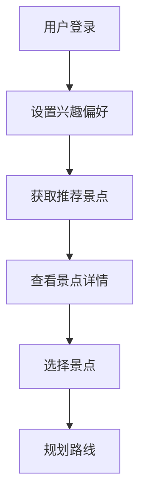
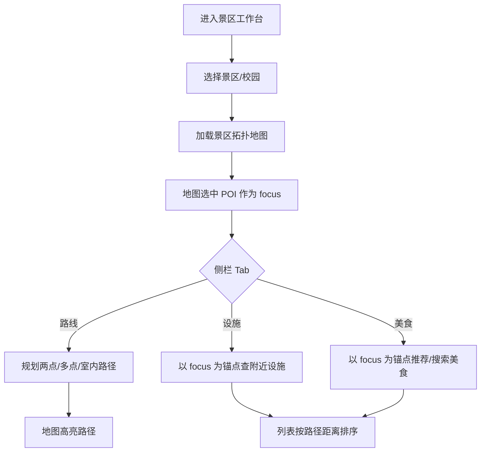
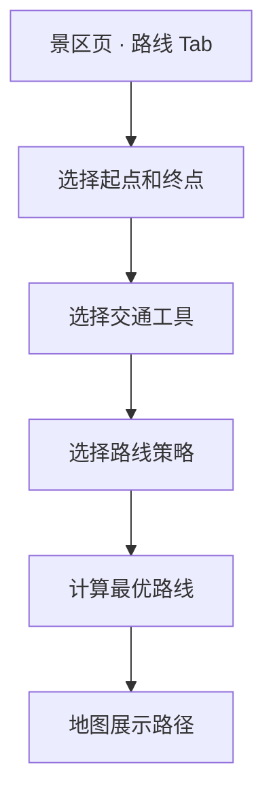
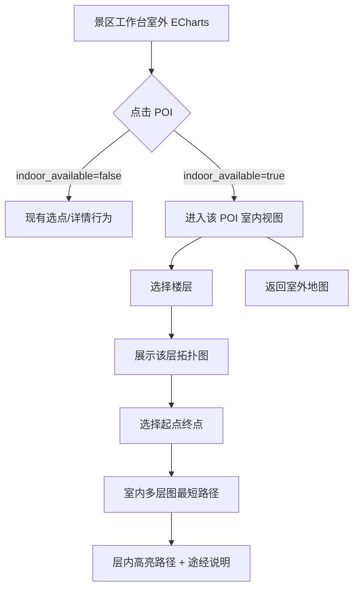
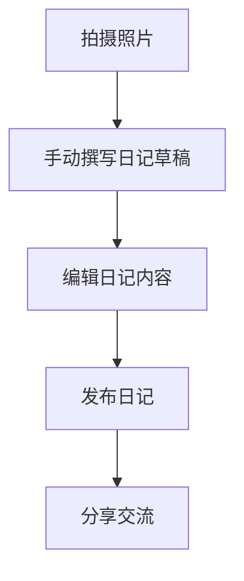

# 个性化旅游推荐系统需求规格说明书

## 1. 项目概述
### 1.1 项目背景
随着人们生活水平的提高，旅游已经成为人们休闲娱乐的重要方式。然而，面对众多的旅游景点和旅游信息，用户往往难以选择适合自己的旅游目的地，也难以在旅游过程中规划最优的参观线路。个性化旅游系统旨在帮助用户管理旅游活动，提供个性化的旅游推荐和线路规划服务，提升用户的旅游体验。

### 1.2 项目目标
开发一个个性化旅游系统，具备旅游地点推荐、旅游路线规划、旅游场所查询、旅游日记交流等功能，满足用户在旅游前、旅游中和旅游后的各种需求。

### 1.3 目标用户
| 角色 | 描述 | 核心职责 |
|------|------|----------|
| 普通用户 | 旅游爱好者 | 浏览推荐、规划路线、查询场所、撰写日记、分享交流 |
| 管理员 | 系统维护者 | 管理用户、景区信息、道路图、美食信息等 |

### 1.4 项目范围
本项目专注于个性化旅游服务，包括旅游目的地推荐、景区内线路规划、场所查询、旅游日记管理和美食推荐等功能。系统将覆盖景区和校园等多种旅游场景。

## 2. 功能需求
### 2.1 旅游前功能
#### 2.1.1 功能列表
| 功能编号 | 功能名称 | 优先级 | 描述 | 验收标准 |
|----------|----------|--------|------|----------|
| FR-001 | 旅游目的地推荐 | 高 | 根据旅游目的地的热度、评价和个人兴趣，为用户推荐合适的旅游目的地。个人兴趣类型包括：自然风光、历史文化、主题乐园、美食、购物、休闲娱乐等。系统通过用户兴趣与景点标签的匹配度进行量化计算。 | 系统能够根据热度、评价和个人兴趣推荐旅游目的地 |
| FR-002 | 目的地信息查询 | 高 | 提供旅游目的地的详细信息，包括景点介绍、开放时间、门票价格、交通信息、最佳游览时间、联系方式等。 | 系统能够提供旅游目的地的详细信息 |
| FR-003 | 个人兴趣设置 | 中 | 用户可以设置个人兴趣偏好，系统根据偏好进行推荐。用户可以选择多个兴趣类型，并设置各兴趣类型的权重。 | 用户能够设置个人兴趣偏好，系统根据偏好进行推荐 |

### 2.2 旅游中功能

#### 2.2.0 景区一体化工作台（旅游中入口）

| 功能编号 | 功能名称 | 优先级 | 描述 | 验收标准 |
|----------|----------|--------|------|----------|
| FR-017 | 景区一体化工作台 | 高 | 将**旅游路线规划**、**场所（设施）查询**、**美食推荐**整合在单一「景区」页面内完成；用户须先选定景区/校园，在**同一张景区拓扑地图**上操作。页面共享上下文：`areaId`（当前景区）与 `focusPoiId`（地图选中的景点或场所）。子导航**不得**将路线、设施、美食拆为三个平行顶级页面。室内导航（FR-004-5）作为地图视图切换，不单独占入口。 | 用户在一个景区页内可完成选点、路线规划、以选中 POI 为锚点的设施查询与美食查询；从推荐页可一键进入指定景区工作台 |
| FR-017-1 | 地图选中 POI 为查询锚点 | 高 | 设施与美食的「附近」均相对于用户在地图上**选中的景点或场所**（`focusPoiId`），**非**浏览器 GPS 真实地理位置。未选中 POI 时，设施/美食区提示先选点；可选用景区中心作为兜底并明示。 | 设施/美食结果标题展示锚点名称；不默认调用 Geolocation |
| FR-017-2 | 景区页布局 | 中 | 桌面：地图主区域 + 侧栏面板（Tab：路线 \| 设施 \| 美食 \| 详情）。移动：地图 + 底部可拖拽面板。详见 [景区工作台设计](../Tech/Scenic%20Hub%20Page%20Design.md)。 | 答辩可演示同一景区下切换 Tab 不丢失地图选中点 |

**与 FR-004 / FR-006 / FR-013 关系**：算法与验收指标仍以各 FR 为准；FR-017 规定**交互容器与上下文**，不改变 Dijkstra / TopK / 模糊检索等核心算法要求。

#### 2.2.1 旅游路线规划
| 功能编号 | 功能名称 | 优先级 | 描述 | 验收标准 |
|----------|----------|--------|------|----------|
| FR-004 | 最优参观线路规划 | 高 | 在景区（包括校园）内部根据游览目标规划最优的参观线路。最优线路的评价标准包括：距离最短、时间最短、景点覆盖最多等，用户可以选择优先考虑的因素。 | 系统能够在景区内部规划最优的参观线路 |
| FR-004-1 | 最短距离策略 | 高 | 规划距离最短的线路 | 系统能够实现最短距离策略的线路规划 |
| FR-004-2 | 最短时间策略 | 高 | 考虑道路拥挤度的情况下规划时间最短线路。道路拥挤度采用“按交通工具划分”的结构化数据（如 walk/bike/shuttle 对应各自拥挤度），取值范围为 [0,1]。真实速度=交通工具基础速度与道路理想速度约束后的速度 × 对应交通工具拥挤度。由于无法实时获取真实拥堵，本系统在生成路网数据时为每条道路的每种可通行交通工具随机生成 0~1 的模拟拥挤度。 | 系统能够实现基于交通工具维度拥挤度的最短时间策略 |
| FR-004-3 | 交通工具的最短时间策略 | 中 | 校区内可选择自行车和步行，景区内可选择步行和电瓶车。每条道路可允许多种交通工具通行，并为每种交通工具配置独立拥挤度。路径规划时需严格按所选交通工具过滤可通行道路；前端在用户选中规划路径后，需可查看路径上道路允许通行的交通工具类型及对应拥挤度。步行速度为4km/h，自行车速度为12km/h，电瓶车速度为20km/h。 | 系统能够实现不同交通工具的最短时间策略，并在路径结果中展示道路可通行交通工具及对应拥挤度 |
| FR-004-4 | 导航功能的图形界面 | 中 | 设计包括地图展示和输出路径展示的导航界面。地图数据使用离线地图包，支持基本的导航功能。 | 系统能够展示导航功能的图形界面 |
| FR-004-5 | 室内导航（按 POI） | 高 | 对**具备室内图数据**的 POI（通常为建筑物类：教学楼、博物馆、枢纽站厅等），在**景区工作台**室外 **ECharts 拓扑图**上可识别并进入该 POI 的**室内分层地图**；室内图与室外景区路网解耦，**每个 POI 至多一套室内图**。室内路径规划覆盖课程要求的三类场景：**建筑入口→电梯/楼梯**、**楼层间竖向交通**、**同层内到达目标房间/设施**。数据来源为 **OpenStreetMap Indoor 要素**，通过种子脚本（Overpass）**自动导入**，禁止手描点造图。课设验收以「功能可演示」为准：至少 **1 个** POI 具备完整室内图并可完成一次室内路径演示；不要求全部 POI/景区均有室内数据。 | 用户能在室外图上进入至少一个「支持室内导航」的 POI，分楼层查看室内图并完成室内最短路径规划 |
| FR-004-5-1 | 室内图数据自动采集 | 高 | 在现有 `osm_seed` 管线（或等价脚本）上扩展：对目标 POI/建筑范围查询 OSM 室内标签（如 `indoor=*`、`level=*`、`highway=corridor|elevator|steps`、`indoor=door` 等），生成**室内节点、室内边、楼层**及 POI 级元数据。导入时按**已定稿完整度规则**（见下）判定；全部满足则 `indoorAvailable=true`，否则跳过该建筑。无 OSM 室内数据的 POI 保持仅室外能力，不报错。**完整度规则（定稿）**：① 至少 **1** 个楼层；② **不要求** 必须具备电梯/楼梯；③ 至少 **2** 个房间节点（`room`）；④ 至少 **3** 条走廊边（`corridor`）；⑤ 走廊+房间诱导子图**连通**（单一连通分量）。 | 种子产物中含室内图 JSON/表结构；至少一个 POI 的 `indoorAvailable=true` 且数据由脚本自动生成 |
| FR-004-5-2 | 室外地图入口与室内视图切换 | 高 | 景区工作台室外 **ECharts** 图上，POI 以节点展示；`indoorAvailable=true` 的 POI 须有**可区分样式**（如图标、描边或角标）。用户**点击**该节点后进入**室内视图**（非新浏览器页亦可，但须明确模式切换）；提供「返回室外地图」入口。未具备室内图的 POI 点击行为与现网一致（选点/详情），不进入室内视图。 | 室外图可识别并点击进入室内模式；可返回室外图 |
| FR-004-5-3 | 分楼层室内地图展示 | 高 | 室内视图沿用 **ECharts** 图模型：当前楼层平面内，**走廊/通道**为边，**门、电梯口、房间/设施**为节点；默认展示一层，提供**楼层切换**（下拉或分页 Tab，楼层号与 OSM `level` 对齐）。支持缩放/拖拽；可选展示同层路径高亮。每层独立坐标系（平面投影坐标或归一化平面坐标），不要求叠加离线底图瓦片。 | 用户可切换楼层并看到该层节点与通道拓扑 |
| FR-004-5-4 | 室内最短路径规划 | 高 | 在室内视图中，用户选择**起点、终点**（从当前层节点列表或图中点选）；系统在**多层图**上计算**最短距离**（与室外 `strategy=distance` 一致：Dijkstra 边权为**米**）。同层走廊边为平面几何距离；若存在电梯/楼梯边，竖向边使用**固定等效距离（米）**（见技设 `app.indoor.vertical-edge-distance-meters`），**不**将「秒」写入 `distance` 字段。可选展示等效步行时间 = 总距离 / 步行速度。**核心算法**为自建数据结构上的 Dijkstra。路径结果在室内图上高亮，并文字列出途经楼层与关键节点。 | 在演示 POI 上可规划并展示一条室内最短路径（同层或含竖向边） |

**室内导航补充说明（与课程讲义对齐）**

- **交互模型**：室外景区路网（已有）→ 点击**单个建筑物 POI** → 该 POI 的室内分层图；一个 POI 一套室内数据，子点位（房间、门）通过 `parent_id` 归属该建筑 POI 或使用独立室内节点 ID 关联。
- **覆盖策略**：室内数据可用性依赖 OSM 社区制图；系统通过 `indoorAvailable` 暴露能力，**不对无数据 POI 伪造室内图**。
- **与 FR-004-4 关系**：本期仍不引入离线地图包；室外/室内均以 **ECharts 拓扑图** 满足「地图展示 + 路径展示」。FR-004-4 仍为可选用能力；**FR-004-5 为必做**。

#### 2.2.2 场所查询
| 功能编号 | 功能名称 | 优先级 | 描述 | 验收标准 |
|----------|----------|--------|------|----------|
| FR-005 | 景点介绍 | 高 | 提供景区内各个景点的详细介绍和相关信息 | 系统能够提供景点的详细介绍 |
| FR-006 | 场所查询 | 高 | 提供景区内各种服务设施的查询功能，如商店、饭店、洗手间等 | 系统能够查询景区内的各种服务设施 |
| FR-006-1 | 附近设施查找 | 高 | 在**已选景区内**，以用户**选中的景点或场所**为锚点，找出其附近一定范围内（默认 500 m，可调 200/500/1000 m）的超市、卫生间等设施，并按**锚点到设施的实际可达路径距离**排序（**禁止**仅按直线距离排序；**禁止**以用户 GPS 坐标作为主锚点）。 | 系统能够相对选中 POI 找出设施并按路网最短路径距离排序 |
| FR-006-2 | 类别过滤 | 中 | 通过选择类别对查询结果进行过滤 | 系统能够通过类别过滤查询结果 |
| FR-006-3 | 类别名称查询 | 中 | 用户输入类别名称，在**当前锚点 POI 附近**查找服务设施，并按**实际可达路径距离**排序。类别名称支持模糊匹配。 | 系统能够根据类别名称在锚点附近查找设施并排序 |
| FR-006-4 | 设施结果地图联动 | 中 | 在景区工作台设施查询返回结果后，除侧栏列表外，须在**同一张拓扑地图**上**高亮显示**命中的设施 POI，并**突出显示设施名称**（标签加粗/放大）；列表项悬停或与地图节点联动时，对应设施在图上进一步强调。锚点 POI 样式须与命中设施可区分。 | 查询卫生间等后，地图上可见高亮设施点及名称；列表悬停时地图对应点同步强调 |

#### 2.2.3 美食推荐
| 功能编号 | 功能名称 | 优先级 | 描述 | 验收标准 |
|----------|----------|--------|------|----------|
| FR-013 | 美食推荐 | 高 | 在**景区工作台**内，以选中景区及**锚点 POI**（或明示的景区中心兜底）为参照，推荐附近 1000 m 范围内美食。距离指**路网可达路径距离**（与 FR-006-1 一致）。饮食偏好（辣度/口味）为可选增强。 | 系统能够在景区页推荐美食，距离为路径距离 |
| FR-013-1 | 美食排序 | 高 | 按热度、评价和**路径距离**加权排序；**不经过完全排序**选出前 10（TopK）。默认权重 0.3/0.5/0.2，可调。 | 系统能够 TopK 排序美食，距离为路径距离 |
| FR-013-2 | 菜系过滤 | 中 | 根据菜系进行过滤 | 系统能够根据菜系过滤美食 |
| FR-013-3 | 模糊查询 | 中 | 输入美食名称、菜系、饭店或窗口名称等进行基于内容的模糊查询，支持部分匹配和同义词。 | 系统能够进行基于内容的模糊查询 |
| FR-013-4 | 查询结果排序 | 中 | 模糊查询命中多项时，按热度、评价和**路径距离**排序 | 系统能够对查询结果按三维加权排序 |

### 2.3 旅游后功能
#### 2.3.1 旅游日记管理
| 功能编号 | 功能名称 | 优先级 | 描述 | 验收标准 |
|----------|----------|--------|------|----------|
| FR-007 | 旅游日记生成 | 中 | 用户手动生成旅游日记，可填写标题、正文，并上传图片/视频或关联目的地信息。 | 用户能够手动生成旅游日记 |
| FR-008 | 旅游日记管理 | 高 | 用户可以查看、编辑和管理自己的旅游日记 | 用户能够查看、编辑和管理自己的旅游日记 |
| FR-008-1 | 日记撰写 | 高 | 用户可以通过文字、图片和视频等方式记录旅游内容。支持的图片格式包括JPG、PNG，视频格式包括MP4，单文件大小限制为10MB。 | 用户能够通过文字、图片和视频撰写日记 |
| FR-008-2 | 统一管理 | 中 | 对所有用户的旅游日记进行统一管理 | 系统能够对所有用户的旅游日记进行统一管理 |
| FR-008-3 | 日记浏览和查询 | 高 | 用户可以浏览和查询所有用户的旅游日记 | 用户能够浏览和查询所有用户的旅游日记 |
| FR-008-4 | 日记热度计算 | 中 | 旅游日记的热度按浏览次数计算，权重固定为1.0（每次有效浏览+1，不做近期加权）。 | 系统能够计算旅游日记的热度 |
| FR-008-5 | 日记评分 | 中 | 用户可以对旅游日记进行评分（1-5星） | 用户能够对旅游日记进行评分 |
| FR-008-6 | 日记推荐 | 中 | 按照日记热度、评价和个人兴趣进行推荐，推荐算法基础为排序算法 | 系统能够按照热度、评价和个人兴趣推荐日记 |

#### 2.3.2 旅游日记交流
| 功能编号 | 功能名称 | 优先级 | 描述 | 验收标准 |
|----------|----------|--------|------|----------|
| FR-009 | 旅游日记交流 | 高 | 用户可以分享和交流旅游日记，查看其他用户的旅游经历 | 用户能够分享和交流旅游日记 |
| FR-009-1 | 目的地相关日记查询 | 中 | 用户可以输入旅游目的地，对目的地相关的旅游日记根据热度和评分进行排序。相关性判断基于日记标题、内容和标签与目的地的匹配度。 | 用户能够查询目的地相关的旅游日记并排序 |
| FR-009-2 | 日记名称精确查询 | 中 | 用户可以输入旅游日记的名称进行精确查询，考虑日记数量较大、变化快的情况 | 用户能够通过名称精确查询旅游日记 |
| FR-009-3 | 全文检索 | 中 | 可以按日记内容进行全文检索 | 系统能够按日记内容进行全文检索 |
| FR-009-4 | 压缩存储 | 低 | 对旅游日记进行压缩存储 | 系统能够对旅游日记正文进行压缩存储，并在读取与检索时自动解码且不影响搜索结果 |
| FR-009-5 | 旅游动画生成 | 低 | 基于用户日记中的**文字与图片**，调用**第三方云端视频生成服务**（图生视频/文生视频等，由部署环境配置 API Key，不在浏览器暴露密钥）。提交任务时可选用画幅、风格、时长与补充提示词（未传项由服务端默认）；若对接会话型备用链路（LibTV），可在本站查看助手摘要并由用户追加消息直至成片。生成任务一般为异步；成片由服务端**下载落盘**后以本站静态资源 URL **与日记关联并持久化**（见 §2.3.3）。 | 用户能触发动画生成并可选参数；成功后可在日记中播放/查看本站持久链接；在 LibTV 场景下可与会话助手往返直至出片 |

#### 2.3.3 旅游动画持久化策略（策略 B，必选）

- **落盘位置**：服务端将厂商返回的视频文件下载至本地资源目录（与日记附件同一体系，例如 `data/media/video` 下单设的 `animation/` 或等价路径），通过 **`/media/**` 静态映射**对外提供访问。
- **日记关联**：数据库中为日记增加 **`animation_url`（或等价字段）** 存储本站相对/绝对可访问路径；**不以厂商临时 URL 作为唯一持久化依据**（避免链接过期导致日记失效）。
- **隐私与安全**：向云端提交的文本与图片均为用户日记内容，须在界面提示「内容由第三方服务处理」；API Key 仅置于服务端配置（环境变量/密钥管理）。

#### 2.3.4 可选云端服务商参考（免费/试用额度以官网为准）

> **说明**：视频生成多为按量计费；所谓「免费」通常为**新用户赠送额度、限时试用、学生计划或极低配额**，上线前请在厂商控制台核实余额与条款。下列仅为集成选型参考，**不构成背书**；接入时需验证 API 形态（异步任务、图生视频字段）与本系统字段是否匹配。

| 类型 | 参考方向 | 备注 |
|------|----------|------|
| 国内公有云 | **阿里云 DashScope（通义万相等）**、**腾讯云**、**火山引擎**、**百度智能云** | 常有试用金或短试用；需实名认证；文档与账单清晰，适合课程演示选用其一并完成端到端联调。 |
| 海外聚合/API | **Replicate**、**Hugging Face Inference** | 常见「注册赠少量额度」或低价按秒计费；适合已有国际支付或课程提供的账号；注意跨境延迟与内容审核。 |
| 需谨慎甄别 | 名称含「Free Veo API」等第三方聚合站 | 多为非官方封装，稳定性与合规风险较高，**不建议**作为课程唯一依赖。 |

### 2.4 系统管理功能
| 功能编号 | 功能名称 | 优先级 | 描述 | 验收标准 |
|----------|----------|--------|------|----------|
| FR-010 | 用户管理 | 高 | 管理系统用户信息，支持用户注册、登录等功能。用户角色包括普通用户和管理员，管理员具有系统配置和数据管理权限。 | 系统能够管理用户信息，支持用户注册、登录等功能 |
| FR-011 | 景区信息管理 | 高 | 管理景区和校园的基本信息，包括景点、POI和服务设施等 | 系统能够管理景区和校园的基本信息 |
| FR-012 | 道路图管理 | 高 | 管理景区和校园内部的道路图，包括POI和服务设施的位置信息 | 系统能够管理景区和校园内部的道路图 |
| FR-014 | 美食信息管理 | 中 | 管理景区和校园内的美食信息，包括名称、菜系、评价等 | 系统能够管理美食信息 |
| FR-015 | 系统通知 | 低 | 系统向用户发送推荐更新、活动通知等信息 | 系统能够向用户发送推荐更新、活动通知等信息 |
| FR-016 | 数据备份与恢复 | 高 | 定期备份系统数据，并提供数据恢复功能 | 系统能够定期备份数据，并提供数据恢复功能 |

## 3. 非功能需求
### 3.1 性能需求
- 系统响应时间应在3秒以内
- 线路规划算法计算时间应在2秒以内
- 全文检索响应时间应在1秒以内

### 3.2 安全需求
- 系统应实现数据加密存储
- 防止SQL注入和XSS攻击
- 保护用户隐私

### 3.3 可用性需求
- 界面设计应简洁美观
- 操作流程应直观易用
- 支持响应式设计，适配不同设备屏幕

### 3.4 兼容性需求
- 系统应兼容主流浏览器（Chrome、Firefox、Safari、Edge）
- 系统应兼容移动设备（iOS、Android）

### 3.5 可扩展性需求
- 系统应支持后续功能扩展和数据量增长
- 采用模块化设计，便于添加新功能

### 3.6 可维护性需求
- 代码应采用模块化设计，遵循编码规范
- 提供详细的文档和注释

### 3.7 可测试性需求
- 系统应提供完整的测试用例
- 支持单元测试和集成测试

### 3.8 创新性需求
- 系统的创新点体现在：1）结合多种排序算法实现高效的旅游推荐；2）使用图结构实现景区内最优路径规划；3）基于用户行为的个性化推荐；4）AIGC技术生成旅游动画；5）基于 OSM 的**室外—室内一体导航体验**（室外 ECharts 点选进入按 POI 绑定的分层室内图）。

### 3.9 算法要求
- 核心算法必须基于自己设计的数据结构，自己编程实现

### 3.10 系统要求
- 要求最终提供真实可用的系统

## 4. 业务流程图
### 4.1 旅游推荐流程

### 4.2 景区一体化工作台流程（FR-017）

旅游中主入口为**单一景区页**（`/scenic`），路线、设施、美食共享景区与地图选中点上下文。

### 4.2.1 路线规划子流程（FR-004）

### 4.2.2 室内导航交互流程（FR-004-5）

### 4.3 旅游日记流程

## 5. 数据需求
### 5.1 数据实体
| 实体名称 | 描述 |
|---------|------|
| 用户 | 系统用户，包含基本信息和兴趣偏好 |
| 景区/校园 | 旅游目的地，包含基本信息和位置 |
| POI | 景区和校园内的兴趣点，如景点、教学楼、办公楼等；**建筑物类 POI** 可关联一套室内图（见室内图实体） |
| 服务设施 | 景区和校园内的服务设施，如商店、饭店、洗手间等 |
| 道路图 | 景区和校园内部的道路网络，包含道路理想速度与“交通工具类型->拥挤度”的结构化配置 |
| 室内图 | **从属于单个 POI（建筑）** 的多层室内路网；含楼层列表、室内节点、室内边（含走廊与竖向边） |
| 旅游日记 | 用户的旅游记录，包含照片、视频和文字描述 |
| 评价 | 用户对景点、服务和旅游日记的评价 |
| 交通工具 | 可用的交通工具类型和对应路线 |
| 美食 | 景区和校园内的美食信息，包含名称、菜系、评价等 |
| 饭店/窗口 | 提供美食的场所，包含名称、位置等信息 |

### 5.2 数据字典
| 实体 | 字段 | 类型 | 描述 |
|------|------|------|------|
| 用户 | id | BIGINT | 用户ID |
| 用户 | username | VARCHAR | 用户名 |
| 用户 | password | VARCHAR | 密码（加密存储） |
| 用户 | email | VARCHAR | 邮箱 |
| 景区/校园 | id | BIGINT | 景区ID |
| 景区/校园 | name | VARCHAR | 景区名称 |
| 景区/校园 | type | VARCHAR | 景区类型（普通景区、校园等） |
| POI | id | BIGINT | POI ID |
| POI | name | VARCHAR | POI 名称 |
| POI | type | VARCHAR | POI 类型（如 scenic_spot、teaching 等） |
| POI | parent_id | BIGINT | 父 POI ID；室内房间/门等点位指向所属建筑 POI |
| POI | indoor_available | BOOLEAN | 是否具备可用室内图（由种子脚本完整度评分写入） |
| 室内图 | building_poi_id | BIGINT | 所属建筑 POI ID（与 POI 一对一） |
| 室内图 | levels | JSON | 楼层元数据（level 编号、显示名、排序） |
| 室内图 | source | VARCHAR | 数据来源标识（如 `osm-overpass`） |
| 室内图 | completeness_score | DOUBLE | 导入时完整度评分（用于运维筛选） |
| 室内节点 | id | BIGINT | 室内节点 ID |
| 室内节点 | building_poi_id | BIGINT | 所属建筑 POI |
| 室内节点 | level | VARCHAR | 楼层（与 OSM level 对齐） |
| 室内节点 | name | VARCHAR | 节点名称（房间号、电梯、门等） |
| 室内节点 | node_kind | VARCHAR | 类型：corridor_junction / door / elevator / stairs / room 等 |
| 室内节点 | x | DOUBLE | 层内平面 X（投影或归一化坐标） |
| 室内节点 | y | DOUBLE | 层内平面 Y |
| 室内边 | id | BIGINT | 室内边 ID |
| 室内边 | building_poi_id | BIGINT | 所属建筑 POI |
| 室内边 | start_node_id | BIGINT | 起点室内节点 |
| 室内边 | end_node_id | BIGINT | 终点室内节点 |
| 室内边 | edge_kind | VARCHAR | corridor / elevator / stairs |
| 室内边 | distance | DOUBLE | 边权（同层为平面距离；竖向边可为固定代价） |
| 道路 | id | BIGINT | 道路ID |
| 道路 | start_id | BIGINT | 起点ID（POI或设施） |
| 道路 | end_id | BIGINT | 终点ID（POI或设施） |
| 美食 | id | BIGINT | 美食ID |
| 美食 | name | VARCHAR | 美食名称 |
| 美食 | cuisine | VARCHAR | 菜系 |
| 日记 | id | BIGINT | 日记ID |
| 日记 | title | VARCHAR | 日记标题 |
| 日记 | content | TEXT | 日记内容 |

### 5.3 数据规模要求
| 数据类型 | 规模要求 |
|---------|----------|
| 景区和校园数量 | 至少200个（最低要求），系统应支持1000个以上的扩展 |
| POI数量 | 每个景区和校园不少于20个 |
| 服务设施种类 | 不少于10种 |
| 服务设施数量 | 不少于50个 |
| 道路图边数 | 不少于200条 |
| 系统用户数 | 不少于10人（最低要求），系统应支持10000个以上的用户 |
| 具备室内图的 POI 数量 | 课设演示**至少 1 个** POI `indoor_available=true`；建议种子阶段目标 **≥3 个**（选自 OSM 室内数据较完整的建筑/站厅/博物馆） |

### 5.4 数据关系
- 用户与旅游日记：一对多关系，一个用户可以创建多个旅游日记
- 用户与评价：一对多关系，一个用户可以发表多条评价
- 景区/校园与POI：一对多关系，一个景区/校园包含多个POI
- 建筑 POI 与室内图：一对一关系，一个建筑物 POI 至多一套室内图
- 建筑 POI 与室内节点：一对多关系；室内节点可通过 `parent_id` 与建筑 POI 关联
- 室内图与室内边：一对多关系
- 景区/校园与服务设施：一对多关系，一个景区/校园包含多个服务设施
- 景区/校园与道路图：一对一关系，一个景区/校园对应一个道路图
- 道路图与POI：多对多关系，道路图包含多个POI，POI位于道路图中
- 道路图与服务设施：多对多关系，道路图包含多个服务设施，服务设施位于道路图中
- 景区/校园与交通工具：一对多关系，一个景区/校园支持多种交通工具
- 景区/校园与美食：一对多关系，一个景区/校园包含多个美食
- 景区/校园与饭店/窗口：一对多关系，一个景区/校园包含多个饭店/窗口
- 饭店/窗口与美食：一对多关系，一个饭店/窗口提供多种美食
- 用户与美食：多对多关系，用户可以对多个美食进行评价
- 旅游日记与目的地：多对多关系，一个日记可以关联多个目的地，一个目的地可以关联多个日记

## 6. 接口需求
### 6.1 外部接口
- **云端视频生成（FR-009-5）**：可选接入第三方视频生成 HTTP API（详见 §2.3.3）。密钥仅服务端配置；传输须遵守厂商合规与用户隐私提示。
- **其它业务**：核心检索与路线规划仍以内存算法为准，不依赖外部检索/地图引擎完成课程约束内的计算。

### 6.2 内部接口
| API路径 | 方法 | 功能描述 |
|---------|------|----------|
| /api/auth/* | POST | 用户认证相关接口 |
| /api/recommendation/* | GET | 旅游推荐相关接口 |
| /api/route/* | POST | 路线规划相关接口（含室外最短路径、多点路径等） |
| /api/indoor/* | GET/POST | 室内图与室内路径：按 buildingPoiId 查询楼层与层内拓扑、室内最短路径规划 |
| /api/facility/* | GET | 场所查询相关接口 |
| /api/food/* | GET | 美食推荐相关接口 |
| /api/diary/* | POST/GET | 旅游日记相关接口 |
| /api/admin/* | POST/GET | 系统管理相关接口 |

## 7. 约束与假设
### 7.1 技术约束
- 核心算法必须基于自己设计的数据结构，自己编程实现
- 课程实现约束：核心数据结构与算法实现不得直接使用 Java 内置集合类型及其实现（如 `java.util.ArrayList`、`java.util.LinkedList`、`java.util.HashMap`、`java.util.TreeMap`、`java.util.HashSet`、`java.util.PriorityQueue` 等）作为最终实现；需以自定义结构实现（如 `MyList`、`MyMap`、`MySet`、`MyPriorityQueue`）。
- 系统支持中文语言，暂不支持多语言国际化
- 搜索与关联匹配实现约束：系统在实现“关键字查找/模糊查找/全文检索/关联匹配”等功能时，不得使用数据库层的 `LIKE/模糊函数/全文检索机制` 或多表联合查询（JOIN/联合查询）完成搜索计算；必须先将必要数据读入内存并建立索引，然后通过算法在内存中完成检索与匹配。
- 数据库职责约束：数据库仅用于数据持久化与基础读写；系统运行期应采用“数据库预加载 -> 内存数据结构/索引 -> 应用层算法处理”的方式，在后端应用层完成主要查询、匹配、排序与关联计算逻辑。

## 7. 风险/依赖备注

| 类型 | 关联编号/功能点 | 具体内容/说明 | 备注 |
|------|----------------|--------------|------|
| 风险 | FR-004 | 最优参观线路规划算法的准确性和效率 | 需设计高效的路径规划算法 |
| 风险 | FR-004-2 | 按交通工具维度的道路拥挤度模拟与计算 | 需设计稳定可复现的随机拥挤度生成策略 |
| 风险 | FR-004-3 | 多交通工具可通行路网的过滤与展示一致性 | 需保证路径过滤、时间计算与前端展示使用同一套道路模式数据 |
| 风险 | FR-004-5 | OSM 室内数据稀疏或结构不统一 | 以完整度评分筛选演示 POI；答辩材料说明覆盖策略；优先选择地铁/博物馆等 OSM 室内较全场景 |
| 风险 | FR-004-5-1 | Overpass 查询超时或要素缺失 | 按建筑 bbox 分批拉取；保留 raw JSON 便于补映射规则 |
| 依赖 | FR-004-5-1 | OpenStreetMap 社区室内制图质量 | 与室外种子相同，依赖 OSM + Overpass；不手描点 |
| 风险 | FR-006-1 | 实际可达路径距离的计算 | 需考虑复杂的道路网络 |
| 风险 | FR-008-6 | 旅游日记推荐的准确性 | 需设计有效的排序算法 |
| 风险 | FR-009-3 | 全文检索的效率 | 需设计高效的文本搜索算法 |
| 风险 | FR-009-5 | 云端视频生成的额度、异步时长与内容审核 | 需选用稳定厂商或预留试用额度；异步任务与失败重试需在服务端实现 |
| 风险 | FR-013-1 | 美食排序的效率和准确性 | 需设计高效的排序算法，特别是前10名的选择 |
| 风险 | FR-013-3 | 模糊查询的准确性和效率 | 需设计高效的模糊查找算法 |
| 依赖 | FR-011 | 景区和校园信息的完整性和准确性 | 需建立可靠的信息采集机制 |
| 依赖 | FR-012 | 道路图数据的质量和完整性 | 建议爬取真实地图数据 |
| 依赖 | FR-014 | 美食信息的完整性和准确性 | 需建立可靠的美食信息采集机制 |
| 风险 | 数据规模 | 数据量较大可能影响系统性能 | 需考虑数据存储和查询优化 |
| 依赖 | FR-001 | 个性化推荐的准确性 | 需积累足够的用户数据和偏好信息 |
| 风险 | FR-016 | 数据备份与恢复的可靠性 | 需建立完善的备份策略和测试机制 |

## 8. 验收标准

| 需求编号 | 验收标准 |
|---------|----------|
| FR-001 | 系统能够根据热度、评价和个人兴趣推荐旅游目的地 |
| FR-002 | 系统能够提供旅游目的地的详细信息 |
| FR-003 | 用户能够设置个人兴趣偏好，系统根据偏好进行推荐 |
| FR-004 | 系统能够在景区内部规划最优的参观线路 |
| FR-004-1 | 系统能够实现最短距离策略的线路规划 |
| FR-004-2 | 系统能够实现基于“交通工具维度拥挤度”的最短时间策略 |
| FR-004-3 | 系统能够实现不同交通工具的最短时间策略，并在选中路径时展示道路可通行交通工具及对应拥挤度 |
| FR-004-4 | 系统能够展示导航功能的图形界面 |
| FR-004-5 | 用户能够在室外 ECharts 图上进入至少一个支持室内导航的 POI，分楼层查看室内图并完成室内路径演示 |
| FR-004-5-1 | 室内图数据由 OSM 种子脚本自动生成，且至少一个 POI 标记为 indoor_available |
| FR-004-5-2 | 室外图可区分、点击具备室内图的 POI 并进入室内视图，可返回室外图 |
| FR-004-5-3 | 室内视图支持楼层切换，展示该层通道与点位拓扑 |
| FR-004-5-4 | 演示 POI 上可计算并高亮展示室内最短路径（含竖向交通场景） |
| FR-017 | 用户在一个景区页内可完成选点、路线规划、以选中 POI 为锚点的设施查询与美食查询 |
| FR-017-1 | 设施/美食结果标题展示锚点名称；不默认调用 Geolocation |
| FR-017-2 | 答辩可演示同一景区下切换 Tab 不丢失地图选中点 |
| FR-005 | 系统能够提供景点的详细介绍 |
| FR-006 | 系统能够查询景区内的各种服务设施 |
| FR-006-1 | 系统能够相对选中 POI 找出设施并按路网最短路径距离排序 |
| FR-006-2 | 系统能够通过类别过滤查询结果 |
| FR-006-3 | 系统能够根据类别名称在锚点附近查找设施并排序 |
| FR-006-4 | 查询设施后，地图上高亮命中设施 POI 并突出显示设施名称 |
| FR-007 | 用户能够手动生成旅游日记（填写标题、正文，上传图片/视频或关联目的地） |
| FR-008 | 用户能够查看、编辑和管理自己的旅游日记 |
| FR-008-1 | 用户能够通过文字、图片和视频撰写日记 |
| FR-008-2 | 系统能够对所有用户的旅游日记进行统一管理 |
| FR-008-3 | 用户能够浏览和查询所有用户的旅游日记 |
| FR-008-4 | 系统能够计算旅游日记的热度 |
| FR-008-5 | 用户能够对旅游日记进行评分 |
| FR-008-6 | 系统能够按照热度、评价和个人兴趣推荐日记 |
| FR-009 | 用户能够分享和交流旅游日记 |
| FR-009-1 | 用户能够查询目的地相关的旅游日记并排序 |
| FR-009-2 | 用户能够通过名称精确查询旅游日记 |
| FR-009-3 | 系统能够按日记内容进行全文检索 |
| FR-009-4 | 系统能够对旅游日记进行压缩存储 |
| FR-009-5 | 用户可基于日记文字与图片触发动画生成；服务端调用云端视频生成接口并下载落盘后关联日记，成片可通过本站 URL 长期访问 |
| FR-010 | 系统能够管理用户信息，支持用户注册、登录等功能 |
| FR-011 | 系统能够管理景区和校园的基本信息 |
| FR-012 | 系统能够管理景区和校园内部的道路图 |
| FR-013 | 系统能够在景区页推荐美食，距离为路径距离 |
| FR-013-1 | 系统能够 TopK 排序美食，距离为路径距离 |
| FR-013-2 | 系统能够根据菜系过滤美食 |
| FR-013-3 | 系统能够进行基于内容的模糊查询 |
| FR-013-4 | 系统能够对查询结果按三维加权排序 |
| FR-014 | 系统能够管理美食信息 |
| FR-015 | 系统能够向用户发送推荐更新、活动通知等信息 |
| FR-016 | 系统能够定期备份数据，并提供数据恢复功能 |
| NFR-001 | 系统响应时间在3秒以内，线路规划算法计算时间在2秒以内，全文检索响应时间在1秒以内 |
| NFR-002 | 界面设计简洁美观，操作流程直观易用，支持响应式设计 |
| NFR-003 | 系统支持后续功能扩展和数据量增长 |
| NFR-004 | 系统保证数据的一致性和完整性，数据丢失率低于0.1% |
| NFR-005 | 系统在主流浏览器和移动设备上正常运行 |
| NFR-006 | 系统实现了创新性功能，包括多种排序算法的应用、图结构的路径规划、个性化推荐和AIGC动画生成 |
| NFR-007 | 核心算法基于自己设计的数据结构，自己编程实现 |
| NFR-008 | 提供真实可用的系统 |
| NFR-009 | 系统实现了数据加密存储，防止SQL注入和XSS攻击 |
| NFR-010 | 代码采用模块化设计，遵循编码规范，提供详细的文档和注释 |
| NFR-011 | 系统提供完整的测试用例，支持单元测试和集成测试 |
| 数据规模 | 满足景区、POI、服务设施、道路图和用户的数量要求 |

## 9. 需求实现状态对齐（相对当前代码基线）

> **对齐基准**：`main` @ `74a2e03`（2026-06-08），含室内导航全链路（`6947349`）与 UI/个人中心 PR（`74a2e03`）。对照 `service/impl`、前端页面与 `src/test` 单测整理，供**收尾周答辩**使用。

### 9.0 本期团队范围裁剪（不作为交付项）

以下条目保留在规格书中作为「可选用能力」，**本期明确不做**，答辩材料中须书面说明裁剪原因：

| 需求编号 | 名称 | 裁剪说明 |
|----------|------|----------|
| **FR-004-4** | 离线地图包导航 | 路线/室内均以 **ECharts 拓扑图** 满足地图展示与路径展示；不引入离线瓦片地图包。 |
| **FR-015** | 系统通知 | 未实现推送/消息中心。 |
| **FR-016** | 数据备份与恢复 | 未实现定时备份与恢复流程。 |

### 9.1 收尾周统计摘要

| 维度 | 数量 | 说明 |
|------|------|------|
| 功能需求（FR）合计 | **52** 条（含子项） | 见 §9.2 全量清单；v1.7 新增 FR-017 系列；v1.7.1 新增 FR-006-4 |
| **已实现** | **35** | 主路径可演示、验收口径基本满足 |
| **部分实现** | **12** | 含 S3 登记之 UI/锚点错位（见 §9.4） |
| **待验收** | **1** | FR-009-5 代码已落地，需实机出片 |
| **本期不交付** | **3** | FR-004-4 / FR-015 / FR-016 |
| 后端单元测试类 | **15** | 覆盖推荐、美食、室内、动画、自定义 DS 等 |
| dev-seed + OSM 合并规模 | 景区 **25**、POI **3290**、道路 **3520** | 见 §9.8 |

### 9.2 全量需求清单对照表

状态图例：**已实现** · **部分实现** · **待验收** · **本期不交付**

#### 9.2.1 旅游前

| 编号 | 名称 | 状态 | 实现要点 / 差距 |
|------|------|------|-----------------|
| FR-001 | 旅游目的地推荐 | **已实现** | 热度/评分/兴趣匹配、`/api/recommendation/personalized`、可解释 `reason`、行为学习增权 |
| FR-002 | 目的地信息查询 | **部分实现** | 详情页展示简介、位置、开放时间、票价、热度评分、经纬度；**缺**交通信息、最佳游览时间、联系方式字段与展示 |
| FR-003 | 个人兴趣设置 | **已实现** | 兴趣权重编辑、饼图、持久化、中英文别名归一化 |

#### 9.2.2 旅游中 — 景区工作台与路线规划

| 编号 | 名称 | 状态 | 实现要点 / 差距 |
|------|------|------|-----------------|
| FR-017 | 景区一体化工作台 | **未实现** | 当前为 `/route`、`/facility`、`/food` 三页平行；设计见 [景区工作台设计](../Tech/Scenic%20Hub%20Page%20Design.md) |
| FR-017-1 | 地图 POI 为查询锚点 | **未实现** | 设施页现用 **GPS** `lat/lng`；美食用直线距离 |
| FR-017-2 | 景区页布局 | **未实现** | 待新建 `ScenicHubView` |
| FR-004 | 最优参观线路规划 | **部分实现** | 两点/时间/距离策略可用；**多点 TSP 偶发「无法规划到达路径」**（S3-ROUTE-01）；**未**提供「景点覆盖最多」策略 |
| FR-004-1 | 最短距离策略 | **已实现** | Dijkstra，`strategy=distance` |
| FR-004-2 | 最短时间策略 | **已实现** | 按交通工具维度 `modeProfile` 拥堵度加权 |
| FR-004-3 | 交通工具最短时间 | **已实现** | walk/bike/shuttle 过滤与路径分段展示拥堵度 |
| FR-004-4 | 导航图形界面（离线地图包） | **本期不交付** | 见 §9.0 |
| FR-004-5 | 室内导航（按 POI） | **部分实现** | 算法与 UI 在 **路线页** 已实现；待迁入 **景区工作台**（FR-017） |
| FR-004-5-1 | 室内图自动采集 | **已实现** | `osm_seed` + `indoor_seed`，完整度门禁，`indoorAvailable` |
| FR-004-5-2 | 室外/室内视图切换 | **已实现** | 金色节点、`indoorAvailable` 角标、返回室外 |
| FR-004-5-3 | 分楼层室内展示 | **已实现** | 楼层 Tab、ECharts 拓扑、WGS84/局部坐标兼容 |
| FR-004-5-4 | 室内最短路径 | **已实现** | 多层 Dijkstra、路径高亮、竖向边固定米制代价 |

**室内演示路径**（S2 治理后）：鸿雁路沙河 OSM 包 `areaId` **252**（`map-imports` 唯一包）；图书馆等 `indoorAvailable` POI。旧 dev-seed `502` / 南丰路 `248` 已弃用。

#### 9.2.3 旅游中 — 场所与美食

| 编号 | 名称 | 状态 | 实现要点 / 差距 |
|------|------|------|-----------------|
| FR-005 | 景点介绍 | **已实现** | 景区详情页、地图 POI tooltip（名称/类型/位置/经纬度） |
| FR-006 | 场所查询 | **部分实现** | 后端检索/索引可用；**独立 `/facility` 页**与 FR-017 错位 |
| FR-006-1 | 附近设施查找 | **部分实现** | 后端有 `pathDistance`，但 **锚点为 GPS** 非选中 POI；须 `anchorPoiId` + 景区页集成 |
| FR-006-2 | 类别过滤 | **已实现** | 类型过滤逻辑可用；待迁入景区页 |
| FR-006-3 | 类别名称查询 | **部分实现** | 模糊匹配可用；**缺**相对锚点的路径距离排序 |
| FR-006-4 | 设施结果地图联动 | **未实现** | 待景区页 `ScenicMapCanvas` 设施高亮层 + 列表悬停联动 |
| FR-013 | 美食推荐 | **部分实现** | TopK/模糊已实现；距离为 **直线** 非路径；**独立 `/food` 页**；未接入饮食偏好 |
| FR-013-1 | 美食排序 | **部分实现** | TopK 可用；距离维度须改为路径距离（相对 `focusPoiId`） |
| FR-013-2 | 菜系过滤 | **已实现** | 菜系条件过滤 |
| FR-013-3 | 美食模糊查询 | **部分实现** | NGram 倒排 + 部分匹配；**无**独立同义词表 |
| FR-013-4 | 查询结果排序 | **部分实现** | 加权排序可用；距离维度须为路径距离 |

#### 9.2.4 旅游后 — 日记

| 编号 | 名称 | 状态 | 实现要点 / 差距 |
|------|------|------|-----------------|
| FR-007 | 旅游日记生成 | **已实现** | 手动撰写、目的地关联、附件上传 |
| FR-008 | 旅游日记管理 | **已实现** | 列表/详情/编辑/删除（所有者）；Lookbook 双栏列表（PR `74a2e03`） |
| FR-008-1 | 日记撰写 | **已实现** | 文字 + JPG/PNG/MP4 拖拽上传，10 MB 限制 |
| FR-008-2 | 统一管理 | **部分实现** | 全站可浏览；**无**管理端日记审计/批量治理接口 |
| FR-008-3 | 日记浏览和查询 | **已实现** | 统一搜索、即时候选、目的地/关键词检索 |
| FR-008-4 | 日记热度计算 | **已实现** | 浏览 +1，权重固定 1.0 |
| FR-008-5 | 日记评分 | **已实现** | 1–5 星，`/api/diary/rate` |
| FR-008-6 | 日记推荐 | **部分实现** | 热度/评分排序 + 兴趣标签 chip 按关联景区筛选；**无**独立后端个性化日记推荐服务 |
| FR-009 | 旅游日记交流 | **部分实现** | 浏览他人日记、评分；**无**日记评论/回复 UI 与接口 |
| FR-009-1 | 目的地相关日记查询 | **已实现** | `destination` 参数 + 热度/评分排序 |
| FR-009-2 | 日记名称精确查询 | **已实现** | Trie 前缀 + 标题匹配（内存索引） |
| FR-009-3 | 全文检索 | **已实现** | NGram 倒排索引，标题/正文 |
| FR-009-4 | 压缩存储 | **已实现** | `DiaryContentCodec` 写库压缩、读时解码 |
| FR-009-5 | 旅游动画生成 | **待验收** | 即梦 + LibTV 编排、异步任务、落盘 `/media`；**需**配置密钥并完成实机出片 |

#### 9.2.5 系统管理

| 编号 | 名称 | 状态 | 实现要点 / 差距 |
|------|------|------|-----------------|
| FR-010 | 用户管理 | **已实现** | 注册/登录/JWT、角色 ADMIN；`GET /api/auth/me`、`POST /api/auth/avatar`（PR `74a2e03`） |
| FR-011 | 景区信息管理 | **已实现** | 管理端录入 + OSM 异步采集生成景区/POI |
| FR-012 | 道路图管理 | **已实现** | 管理端道路录入、`modeProfile`、OSM 真路网种子 |
| FR-014 | 美食信息管理 | **已实现** | 管理端美食录入 |
| FR-015 | 系统通知 | **本期不交付** | 见 §9.0 |
| FR-016 | 数据备份与恢复 | **本期不交付** | 见 §9.0 |

### 9.3 待验收（答辩前必做）

| 编号 | 事项 | 操作指引 |
|------|------|----------|
| **FR-009-5** | AIGC 旅游动画实机出片 | 复制 `jimeng-animation.example.yml` → `jimeng-animation.yml`；配置火山 AK/SK；可选 LibTV Key；执行 `docs/sql/migration_add_animation_url.sql`；在日记详情页触发生成并确认 `/media` 可播放 |
| **演示环境** | dev 无库模式 | `spring.profiles.active=dev`，确认 `ignore-db-connection-failure=true` |
| **室内导航** | 答辩演示脚本 | 景区页（或过渡期路线页）选 areaId **252** → 点击 `indoorAvailable` POI → 室内规划 |
| **FR-017** | 景区一体化 | 新建 `/scenic` 后走通 §4.2 主流程 |

### 9.4 部分实现 — 已知差距（可书面说明，不阻塞主路径演示）

| 编号 | 差距 | 收尾建议 |
|------|------|----------|
| FR-002 | 缺交通/最佳游览时间/联系方式 | 答辩口径：核心字段已展示；扩展字段列为二期 |
| FR-004 | 缺「景点覆盖最多」策略 | 答辩口径：已覆盖距离/时间/多点最优三类主策略 |
| FR-008-2 | 无管理端日记治理 | 答辩口径：用户侧统一管理浏览已满足主流程 |
| FR-008-6 | 兴趣推荐为前端 chip 筛选 | 答辩口径：按关联景区标签 + 用户兴趣过滤，非独立推荐引擎 |
| FR-009 | 无日记评论线程 | 评分与浏览已覆盖「交流」子集 |
| FR-013 / FR-013-3 | 无饮食偏好/同义词 | 加权 TopK + NGram 已满足检索主路径 |
| **FR-017** | 三页分裂、无共享上下文 | S3：新建景区工作台，见技设文档 |
| **FR-006-1 / FR-013-1** | 锚点与距离语义错位 | API 增 `anchorPoiId`；美食改路径距离 |
| **FR-004 多点** | 部分 POI 组合不可达 | S3-ROUTE-01：失败时提示不可达段，非算法重写 |

### 9.5 已实现但易被误判为未完成

| 编号 | 说明 |
|------|------|
| FR-004-4（展示能力） | 虽不做离线地图包，**ECharts 室外/室内拓扑图** 已承担「地图 + 路径展示」答辩演示 |
| FR-007 | **手动**撰写日记，非 AI 自动生成草稿 |
| FR-009-4 | 压缩仅作用于**写库**；内存检索索引保持明文 |
| FR-010 | PR 后已支持头像上传与个人资料 `GET /me` |

### 9.6 非功能需求对齐

| 编号 | 状态 | 说明 |
|------|------|------|
| NFR-001 性能 | **基本满足** | 内存检索与图算法；未做正式压测报告 |
| NFR-002 可用性 | **已实现** | ExploreScape 风格 UI、响应式、表单统一（PR `74a2e03`） |
| NFR-003 可扩展性 | **已实现** | 模块化、`map-imports` 配置化、OSM 管线可扩展 |
| NFR-004 数据一致性 | **部分实现** | 内存+DB 双写有 dev 回退；无备份恢复（FR-016 裁剪） |
| NFR-005 兼容性 | **已实现** | 现代浏览器 + 移动端抽屉导航 |
| NFR-006 创新性 | **待验收** | 依赖 FR-009-5 实机；室内 OSM 导航、行为学习已实现 |
| NFR-007 自研数据结构 | **部分实现** | `com.travel.ds` 包 + 对照单测已就绪；**算法层仍大量 `java.util`**，答辩须能说明替换范围与计划 |
| NFR-008 真实可用 | **已实现** | 前后端可联调、dev-seed 可独立演示 |
| NFR-009 安全 | **部分实现** | JWT、BCrypt、上传校验；DB 密码仍明文配置（工程风险） |
| NFR-010 可维护性 | **已实现** | 需求/技设/HANDOFF 文档齐全 |
| NFR-011 测试覆盖 | **部分实现** | 15 个后端测试类；**无**前端单测、无集成测试全覆盖 |

### 9.7 数据规模对齐（§5.3）

> 统计口径：dev-seed 基线 + `osm-data/*/latest/*.append.json` 合并（与 `DevSeedDataLoader` 加载一致）。

| 指标 | 规格要求 | 当前合并规模 | 状态 |
|------|----------|--------------|------|
| 景区/校园数 | ≥200（可扩展 1000+） | **25** | **未达**（演示数据；架构支持 `map-imports` 扩展） |
| 每景区 POI | ≥20 | 4 个景区 ≥20 POI | **部分满足** |
| 服务设施种类 | ≥10 种 | **6** 种 | **未达** |
| 服务设施数量 | ≥50 | **16** | **未达** |
| 道路边数 | ≥200 | **3520** | **已满足** |
| 用户数 | ≥10 | **6**（种子） | **未达**（功能支持注册扩增） |
| 室内图 POI | 演示 ≥1 | **≥2**（502、900020599 等） | **已满足** |

**答辩建议**：说明规格规模为「系统设计能力上限」，本期以 **OSM 真实校园/景区高质量样本 + 算法可演示** 为主；若验收硬性卡数量，可通过批量 OSM 采集或扩充 seed 快速补齐。

### 9.8 收尾周检查清单（建议本周完成）

- [ ] **FR-009-5** 实机出片 1 条并录屏/截图
- [ ] **室内导航** 走通 1 次完整演示（室外 → 室内 → 规划 → 返回）
- [ ] **个性化推荐** 登录后演示兴趣权重影响排序
- [ ] **景区工作台** 单页演示路线 + 设施 + 美食（FR-017）
- [ ] **路线规划** 演示距离/时间/多点 TSP + 交通工具拥堵度展示
- [ ] **日记** 演示搜索（关键词/目的地）+ 压缩存储说明（技设一页）
- [ ] **答辩 PPT** 写明 FR-004-4/015/016 裁剪与 FR 完成度表（本节 §9.2）
- [ ] **回归**：`mvn test` + `npm run build` 全绿
- [ ] （可选）移除 `application.yml` 明文数据库密码，改环境变量

---

**文档作者**：资深项目经理
**文档版本**：1.7.1
**创建日期**：2026-03-09
**最后更新**：2026-06-08

**v1.7 变更摘要**：新增 FR-017 景区一体化工作台；澄清 FR-006-1/006-3、FR-013 锚点与路径距离语义；§9 登记 S3 错位（三页分裂、GPS 锚点、美食直线距离、多点偶发失败）；室内演示路径改为鸿雁路沙河 areaId=252。

**v1.7.1 变更摘要**：负责人确认景区页布局（桌面侧栏 + 移动 Sheet、旧路由 redirect、美食详情侧栏）；新增 **FR-006-4** 设施查询结果地图高亮与名称突出。