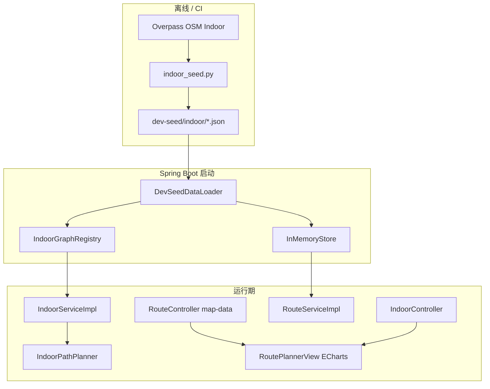

# 室内导航（FR-004-5）开发方案规划

> 依据：`docs/Requirements/Requirements Documendation.md` v1.5（FR-004-5～5-4）、`docs/Tech/Technical Design Document.md` v1.2.1。  
> 状态：**已实现**（阶段 0～6；阶段 7 验收见 §8 检查表）。种子脚本 `scripts/indoor_seed.py` 为骨架，演示数据以 `dev-seed/indoor/502.json` 为准。

---

## 1. 目标与边界

### 1.1 交付目标（课设验收）

| 项 | 标准 |
|----|------|
| 数据 | OSM Overpass **自动**生成室内图，禁止手描点 |
| 覆盖 | 至少 **1** 个 `indoor_available=true` 的建筑 POI 可演示；种子建议 ≥3 |
| 室外入口 | `RoutePlannerView` ECharts 上可区分并**点击**进入室内 |
| 室内展示 | **分楼层** ECharts 拓扑（走廊边 + 房间/门等节点） |
| 路径 | 单层或含电梯/楼梯的**最短距离**（Dijkstra，边权米） |
| 算法 | 复用 `com.travel.algorithm.graph` + 课程 My* 约束 |

### 1.2 不在本期（明确砍掉）

- 室外入口与室内入口的**自动拼接**一条路径（仅提示「可进入室内导航」即可）。
- 离线地图瓦片 / FR-004-4 离线地图包。
- 室内交通工具、拥挤度、最短时间策略。
- 全库 200 景区、每栋楼都有室内图。

### 1.3 已定稿参数

**完整度（二进制，全部满足才导入）**

| # | 规则 |
|---|------|
| 1 | 楼层数 ≥ **1** |
| 2 | **不要求** 电梯/楼梯 |
| 3 | `room` 节点 ≥ **2** |
| 4 | `corridor` 边 ≥ **3** |
| 5 | 走廊子图（含房间节点）**单一连通分量** |

**竖向边权（有 elevator/stairs 时）**

- Dijkstra 使用 **`Edge.distance`（米）**；走廊 = 几何距离；竖向 = **`app.indoor.vertical-edge-distance-meters`**（默认 **10.0**）。
- 展示时间（可选）：`timeSec = totalDistanceM / 1.111`（步行 4 km/h）。

---

## 2. 总体架构



**ID 空间**

- 室外：`roads.start_id/end_id` → POI / 设施 id。
- 室内：`indoor_nodes.id` **独立自增**，不与室外混用。
- 建筑：`building_poi_id` = 室外 `buildings.id`（用户点击的 POI）。

---

## 3. 分阶段实施计划

建议 **2～2.5 周**（可与其它 FR 并行），按依赖顺序执行。

### 阶段 0：契约与配置（0.5 天）

| 任务 | 产出 |
|------|------|
| 确认需求/技设已同步 | 本文 + FR-004-5 |
| 新增 SQL 迁移草稿 | `docs/sql/migration_indoor_navigation.sql` |
| 配置项 | `application.yml` → `app.indoor.vertical-edge-distance-meters: 10.0` |
| 配置类 | `IndoorProperties`（或并入现有 `*Properties`） |

**迁移表（与技设 3.1.15～17 一致）**

- `buildings` 增列：`indoor_available`, `osm_indoor_ref`（可选）
- `indoor_maps`, `indoor_nodes`, `indoor_edges`

**验收**：应用能启动；配置可注入；迁移脚本可在本地 MySQL 执行（dev 可不连库）。

---

### 阶段 1：OSM 室内种子脚本（2～3 天）— 关键路径

| 任务 | 说明 |
|------|------|
| 新建 `scripts/indoor_seed.py`（或扩展 `osm_seed.py` 子命令） | 复用 Overpass 客户端、`user-agent`、输出目录约定 |
| 输入 | 候选建筑：OSM way/relation id 或 `buildings.json` 中带 `osmIndoorRef` 的项；可先对**已有** `map-imports/.../overpass.json` 离线解析做原型 |
| Overpass 查询 | bbox 内 `highway=corridor|elevator|steps`、`indoor=*`、`level=*` |
| 解析 | 节点分类 `node_kind`；边分类 `edge_kind`；楼层归一化 `level` 字符串 |
| 平面坐标 | way 几何 → 以建筑 bbox 左下角为原点的局部米制坐标（与技设一致） |
| 连通性检查 | 仅 `corridor` 边建无向图，统计含 `room` 节点的连通分量，要求唯一 |
| 完整度门禁 | 应用 §1.3 五条；失败写 `indoor/rejected/{id}.json` + 原因 |
| 输出 | `src/main/resources/dev-seed/indoor/{buildingPoiId}.json` |
| 清单 | `dev-seed/indoor/manifest.json`：`[{buildingPoiId, name, areaId, completenessScore:1.0}]` |
| 回写 POI | 生成 `buildings.indoor.patch.json` 或脚本直接改 `buildings.json` 中对应项 `indoorAvailable: true` |

**`indoor/{buildingPoiId}.json` 建议结构**

```json
{
  "buildingPoiId": 101,
  "source": "osm-overpass",
  "completenessScore": 1.0,
  "levels": [{"level": "0", "label": "F1", "order": 0}],
  "entranceNodeId": 1001,
  "nodes": [
    {"id": 1001, "level": "0", "name": "门厅", "nodeKind": "door", "x": 0, "y": 0}
  ],
  "edges": [
    {"id": 1, "startNodeId": 1001, "endNodeId": 1002, "edgeKind": "corridor", "distance": 12.5, "directed": 0}
  ]
}
```

**验收**

- 本地跑脚本后 ≥1 个 JSON 通过门禁；
- `manifest.json` 非空；
- 人工打开 JSON 目视拓扑合理。

**风险缓解**

- 北邮校区 OSM 室内可能不足：脚本对**全国 seed 景区**扫一遍 Overpass，或指定 1 个地铁/博物馆 OSM id 作演示建筑，并在答辩 PPT 说明数据来源。

---

### 阶段 2：后端内存模型与加载（1～1.5 天）

| 任务 | 文件（建议） |
|------|----------------|
| 实体 / DTO | `IndoorMapMeta`, `IndoorNode`, `IndoorEdge`, `IndoorBuildingBundle` |
| `Poi` 增字段 | `indoorAvailable`, `osmIndoorRef` |
| `InMemoryStore` | `Map<Long, IndoorBuildingBundle> indoorByBuildingPoiId`；`putIndoor` / `getIndoor` |
| `DevSeedDataLoader` | 加载 `dev-seed/indoor/*.json`；设置 `poi.indoorAvailable` |
| `IndoorGraphRegistry` | `@PostConstruct` 或 seed 后：由 bundle 构建 `Graph`（合并全楼层节点 + 竖向边） |

**构图规则（`IndoorGraphRegistry`）**

1. 每个 `indoor_nodes.id` → 图顶点。
2. `corridor`：`addUndirectedEdge(u, v, distance, speed=1.0, emptyModeProfile)` 或室内专用 `addUndirectedEdge` 仅 distance。
3. `elevator`/`stairs`：跨层节点对，`distance = verticalEdgeDistanceMeters`（配置）。
4. 缓存 `Map<Long, Graph>` 与 `Map<Long, Map<String, FloorSnapshot>>`（按层切片供 API）。

**验收**：dev profile 启动后日志打印 `Indoor graphs loaded: N`（N≥1）。

---

### 阶段 3：室内路径规划（1 天）

| 任务 | 说明 |
|------|------|
| `IndoorPathPlanner` | `plan(Graph g, long start, long end)` → 复用 `Dijkstra` + `Edge::getDistance` |
| `IndoorServiceImpl` | 校验节点属于 `buildingPoiId`；组装 `segments`（按 level 切段）、`instructions` |
| 指令文案 | 遍历 path，遇 `elevator/stairs/room/door` 追加 `name` |

**`IndoorPlanResult` 字段**

- `path: List<Long>`
- `distance: double`（米）
- `timeSec: double`（可选）
- `segments: [{level, nodeIds}]`
- `instructions: List<String>`

**单元测试**（建议）

- 3 节点链 A—B—C，距离可预期；
- 两层 + 一条竖向边，路径必经竖向；
- 不连通 → 空 path 或明确异常。

**验收**：`mvn -Dtest=IndoorPathPlannerTest test` 通过。

---

### 阶段 4：REST API（1 天）

| 方法 | 路径 | 实现要点 |
|------|------|----------|
| GET | `/api/indoor/buildings?areaId=` | 过滤 `indoorAvailable`，返回 meta 列表 |
| GET | `/api/indoor/{buildingPoiId}/meta` | levels、entranceNodeId |
| GET | `/api/indoor/{buildingPoiId}/floor/{level}` | 该层 nodes + edges（ECharts） |
| POST | `/api/indoor/{buildingPoiId}/plan` | body: `startNodeId`, `endNodeId` |

**Controller**：`IndoorController` `@RequestMapping("/api/indoor")`。

**修改现有**

- `RouteServiceImpl.listRoutePoiCandidates` / `getMapData`：节点 Map 增加 **`indoorAvailable: boolean`**（读 `Poi` 字段）。

**验收**：Postman/curl 四条接口在 dev 下 200；无室内图建筑 404。

---

### 阶段 5：前端路线页（1.5～2 天）

| 任务 | 文件 |
|------|------|
| API 类型与封装 | `frontend/src/lib/api.ts`：`IndoorMeta`, `IndoorFloorGraph`, `IndoorPlanResult`, `apiIndoor*` |
| 状态机 | `RoutePlannerView.vue`：`viewMode`, `buildingPoiId`, `currentLevel`, `indoorLevels`, `indoorGraph`, `indoorStart/End`, `indoorPlan` |
| 室外图 | 点击节点：若 `indoorAvailable` → 进入室内模式，否则保持原选点逻辑 |
| 室内 UI | 顶栏：建筑名 + 返回室外；`el-tabs` 楼层；ECharts graph 同室外配置 |
| 起终点 | `el-select` 列出**全建筑**室内节点（或当前层 + 提示可跨层规划） |
| 规划按钮 | `POST plan` → 高亮 `edges` / `nodes` 路径 |
| 结果区 | 展示 `instructions`、`distance`（米）、可选 `timeSec` |

**ECharts 提示**

- 室内坐标已是平面米制，用 `layout: 'none'` + 节点 `x/y` 直接映射（与室外经纬度转布局区分）。
- `indoorAvailable` 室外节点：`symbolSize` 加大或 `itemStyle.borderColor` 区分。

**验收**：`npm run build` 通过；手动：室外 → 点建筑 → 换层 → 规划一条路径 → 返回室外。

---

### 阶段 6：联调、演示数据与文档（1 天）

| 任务 | 说明 |
|------|------|
| 演示脚本 | `docs/demo/室内导航演示步骤.md`（areaId、buildingPoiId、示例起终点） |
| 更新 §9 实现状态 | 需求文档 FR-004-5 → 已实现 |
| HANDOFF | 记录种子命令、演示 POI id |
| 可选 FR 映射 | 自评表数据结构/算法一行 |

**答辩演示路径（建议）**

1. 打开路线规划 → 选择含室内图的景区。
2. 指出带标记 POI → 点击进入室内。
3. 切换楼层 → 选「大门」到「某房间」→ 规划。
4. 展示路径高亮与文字指引。
5. 说明数据来自 OSM + 完整度规则（幻灯片 1 页）。

---

### 阶段 7：测试与质量（贯穿）

| 类型 | 范围 |
|------|------|
| 单元测试 | `IndoorPathPlanner`、`IndoorGraphRegistry` 构图、完整度判定（可 Java 测或 Python 测） |
| 集成 | `@SpringBootTest` + dev profile：`/api/indoor/...` |
| 回归 | 室外 `POST /api/route` 不受影响 |
| 约束自查 | 室内检索若涉及名称匹配，仍走内存索引，不用 SQL LIKE |

---

## 4. 文件清单（预计新增/修改）

### 新增

```
scripts/indoor_seed.py
docs/sql/migration_indoor_navigation.sql
src/main/resources/dev-seed/indoor/manifest.json
src/main/resources/dev-seed/indoor/{buildingPoiId}.json
src/main/java/com/travel/config/IndoorProperties.java
src/main/java/com/travel/model/entity/IndoorNode.java (或 indoor 包)
src/main/java/com/travel/model/entity/IndoorEdge.java
src/main/java/com/travel/model/dto/indoor/*.java
src/main/java/com/travel/model/vo/indoor/*.java
src/main/java/com/travel/indoor/IndoorBuildingBundle.java
src/main/java/com/travel/indoor/IndoorGraphRegistry.java
src/main/java/com/travel/indoor/IndoorPathPlanner.java
src/main/java/com/travel/service/IndoorService.java
src/main/java/com/travel/service/impl/IndoorServiceImpl.java
src/main/java/com/travel/controller/IndoorController.java
src/test/java/com/travel/indoor/IndoorPathPlannerTest.java
```

### 修改

```
src/main/java/com/travel/model/entity/Poi.java
src/main/java/com/travel/storage/InMemoryStore.java
src/main/java/com/travel/storage/DevSeedDataLoader.java
src/main/java/com/travel/service/impl/RouteServiceImpl.java
src/main/resources/application.yml
frontend/src/lib/api.ts
frontend/src/views/route/RoutePlannerView.vue
docs/Requirements/Requirements Documendation.md  (§9 状态)
docs/AI/HANDOFF.md
```

---

## 5. 依赖顺序（必须遵守）

```
阶段0 配置/迁移
    ↓
阶段1 indoor_seed（先有 JSON）
    ↓
阶段2 加载 + Registry
    ↓
阶段3 PathPlanner ←→ 阶段4 API（可并行）
    ↓
阶段5 前端（依赖 API + map-data 字段）
    ↓
阶段6 演示与文档
```

**可并行**：阶段 1 跑脚本的同时，阶段 0+2 用**手写一份最小** `indoor/demo.json`（2 room + 3 corridor）做后端/前端 stub。

---

## 6. 完整度判定算法（种子脚本伪码）

```text
rooms = count(nodes where node_kind == room)
corridors = count(edges where edge_kind == corridor)
levels = distinct(node.level)

G = undirected graph on nodes that are endpoints of corridor edges
require rooms >= 2 and corridors >= 3 and len(levels) >= 1
require all room nodes in same connected component of G
require G has exactly one connected component containing all corridor endpoints (or all room nodes connected via corridors)

if pass: emit json; set completenessScore = 1.0
else: reject with reason codes [ROOMS, CORRIDORS, LEVELS, DISCONNECTED]
```

---

## 7. 与现有代码对齐要点

| 现有能力 | 室内导航用法 |
|----------|----------------|
| `Dijkstra.shortestPath(graph, start, end, Edge::getDistance, filter)` | 室内默认距离策略 |
| `RouteServiceImpl.getMapData` | 仅扩展 `nodeDetails[].indoorAvailable` |
| `DevSeedDataLoader` + `buildings.json` | 增加 indoor 目录加载 |
| `RoutePlannerView` ECharts graph | 复制一套 `renderIndoorChart()` |
| `osm_seed.py` / `map-imports` | 室内可复用 raw overpass 或单独查询 |

**注意**：`Graph.addUndirectedEdge` 当前签名含 `speed, modeCongestion`；室内走廊可传 `speed=1.0`、`modeCongestion={}` 或扩展 overload **仅 distance**（避免伪造 mode）。

---

## 8. 验收检查表（答辩前勾选）

- [ ] `indoor_seed.py` 一键可复现，README/HANDOFF 有命令
- [ ] ≥1 个 POI `indoor_available`，manifest 可查
- [ ] 室外图可见「支持室内」标记
- [ ] 进入室内、切换楼层、返回室外
- [ ] 室内最短路径高亮 + instructions
- [ ] 无室内图 POI 点击不崩溃
- [ ] `mvn test` / `npm run build` 通过
- [ ] 需求 §8 中 FR-004-5～5-4 可逐条演示
- [ ] 能说明 OSM 来源与完整度五条规则

---

## 9. 工时估算汇总

| 阶段 | 人天（1 人） |
|------|----------------|
| 0 配置/SQL | 0.5 |
| 1 种子脚本 | 2.5 |
| 2 内存加载 | 1.5 |
| 3 路径算法 | 1 |
| 4 API | 1 |
| 5 前端 | 2 |
| 6 联调文档 | 1 |
| 7 测试缓冲 | 1 |
| **合计** | **~10.5** |

两人并行可压到 **~6～7 个工作日**（1+4 并行、2+3 并行）。

---

**文档版本**：1.0  
**编写日期**：2026-05-17
