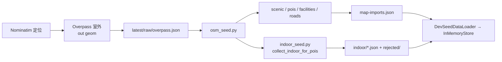
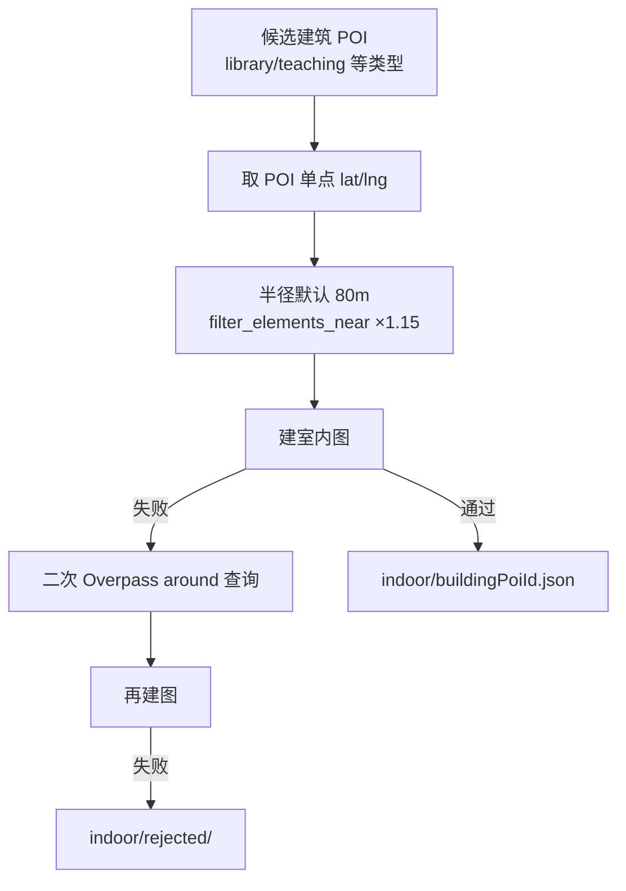
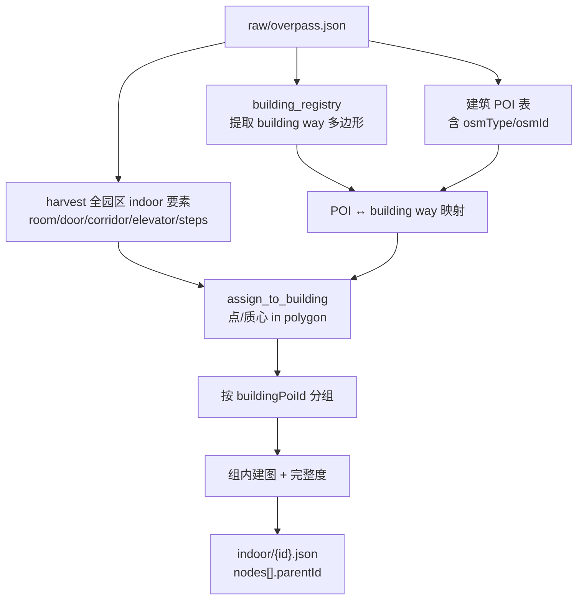
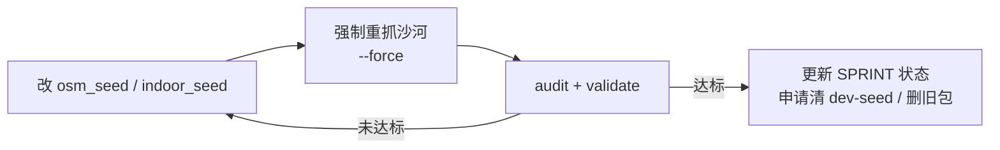

# OSM 地图数据采集：现状说明与重构方案

> **状态**：`待审核` — 负责人审核通过后方可开始编码与沙河沙箱迭代。  
> **关联**：`docs/AI/SPRINT_CLOSURE.md` §2、FR-004-5 / FR-006、需求 §5.2 `parent_id`。  
> **迭代沙箱**：`osm-data/北京邮电大学-沙河校区-南丰路-沙河镇-昌平区-北京市-102206-中国/`  
> **基线提交**：`main` @ `e9f13fb`（2026-06-08）

---

## 1. 管线现状（As-Is）

### 1.1 总体架构



| 组件 | 路径 | 职责 |
|------|------|------|
| 室外采集 | `scripts/osm_seed.py` | Nominatim + Overpass → 景区、POI、设施、道路；可选触发室内 |
| 室内采集 | `scripts/indoor_seed.py` | 按建筑 POI 生成室内图 bundle |
| 产出目录 | `src/main/resources/osm-data/<景区>/latest/` | `*.append.json`、`raw/`、`indoor/` |
| 挂载 | `dev-seed/map-imports.json` | 声明后端加载哪些 append 文件 |
| 校验 | `scripts/validate_osm_output.py` | 字段/拓扑抽查 |
| 审计 | `scripts/_audit_osm_data.py` | raw vs 产出对比（开发用） |

### 1.2 室外 POI / 设施分流（现状）

对 `raw/overpass.json` 每个要素：

1. `classify_poi()` → 写入 `pois.append.json`（library、restaurant、teaching 等）
2. `classify_facility()` → 写入 `facilities.append.json`（**仅** toilet、hospital、bike、service、printer 等少量 `amenity`）
3. 同一要素**可能同时**进入 POI 与 facilities（若两类规则都命中）
4. `fac_rows` 硬上限 **`[:15]`**；`poi_rows` 受 `business_poi_cap` 限制
5. 所有业务 POI 的 **`parentId` 固定为 `null`**

### 1.3 室内采集（现状）— 半径归属

**不是**按 `parent_id` 或建筑轮廓归属，流程为：



| 步骤 | 实现位置 | 说明 |
|------|----------|------|
| 候选筛选 | `collect_indoor_for_pois()` | POI `type` ∈ 允许列表，最多 12 栋，按 library/teaching 优先级排序 |
| 要素裁剪 | `filter_elements_near()` | 要素几何中心到 POI 锚点平面距离 ≤ `radius × 1.15` |
| 建图 | `build_graph_from_osm_elements()` + MST 走廊 + 完整度 | 与室外共用一份 campus `overpass_elements` |
| 失败回退 | `collect_indoor_for_poi()` | 对**每个 POI** 再打 Overpass `around(radius)`（易 504/429） |
| 运行时关联 | bundle.`buildingPoiId` | 室内节点**无** `parentId` 字段 |

### 1.4 审计结论（2026-06-08，四包现有 osm-data）

#### A. 服务设施（FR-006）— 问题**成立**

| 地图包 | raw 设施相关标签* | `facilities.append` | 误入 POI 的同类点位 |
|--------|-------------------|---------------------|---------------------|
| 北邮沙河 | 6 | **1**（hospital） | 6（library×2、restaurant、service、medical×2） |
| 北邮师大北路 | 26 | **2**（hospital×2） | 8（cafe、shop、library、restaurant×4 等） |
| 执信中学 | 1 | 1 | 3 |
| 贵阳一中 | 4 | **0** | 9（含 raw 中 toilets、library） |

\*含 `amenity=cafe/restaurant/library/toilets/...` 或 `shop=supermarket/convenience/...` 等。

**根因**：`classify_facility()` 过窄；商店/饭店/咖啡馆/超市/图书馆等由 `classify_poi()` 进入 POI；设施查询读 `facilities` 表，与需求语义错位。

#### B. 室内（FR-004-5）— 沙河上问题**成立**

| 指标 | 北邮沙河 |
|------|----------|
| raw `indoor=room` way | **97** |
| raw `building=*` way | **13**（含图书馆 `way/685054783`） |
| 室内候选 | 12 栋 |
| 通过 `indoor/` | **1**（学术报告厅 `900020599`，strategy=`raw_elements`） |
| rejected | 8；error（Overpass）3 |

**图书馆 POI `900020591`**：description 已为 `OSM source=way:685054783`，与 building way 一致；但锚点 **80m/120m 内 0 个 room**，200m 内 52 个 → 半径归属失败，`nodes:0` 写入 rejected。

**根因归纳**：

1. 用 **POI 单点 + 固定半径** 代替 **建筑面包含**；
2. 多栋建筑共享 campus raw，**同心圆争抢**同一批 room；
3. 未使用 POI 上已有的 **OSM building way id**；
4. 失败后 **per-POI 二次 Overpass** 不稳定；
5. 完整度门禁在错误归属下放大 reject。

---

## 2. 重构目标（To-Be）

### 2.1 总目标

在 **不改变**「OSM 自动采集 → JSON 种子 → 内存加载」主架构的前提下，使产出与 **FR-006 设施**、**FR-004-5 室内 + parent_id 归属**、**S2 数据真源** 对齐。

### 2.2 分项目标

| # | 目标 | 验收口径（沙河沙箱） |
|---|------|----------------------|
| G1 | **设施**按需求进入 `facilities.append.json` | 洗手间、商店、饭店、食堂、超市、咖啡馆、图书馆等可查询；设施类型 ≥ 需求口径种类 |
| G2 | **室内**按 **建筑 POI / 建筑面** 归属，非半径 | 图书馆等 `osmId` 与 building way 一致的 POI 能产出 indoor bundle |
| G3 | 室内节点写入 **`parentId` = 建筑 POI.id** | 与需求 §5.2 一致；bundle 保留 `buildingPoiId` |
| G4 | **单次 raw 驱动**，避免 per-POI Overpass | 沙河重抓 indoor 阶段无 504/429 依赖（或仅 campus 级一次） |
| G5 | 可 **自动化迭代** | `scripts/_audit_osm_data.py` / 新校验脚本 + 报告可判定达标 |
| G6 | 通过后接 **dev-seed 瘦身** | 仅用户 JSON + 新沙河包 + `map-imports` 单包挂载 |

### 2.3 非目标（本期重构不做）

- 室外—室内路径自动拼接
- 离线地图瓦片
- 全库 200 景区批量重采（仅沙河验证通过后按需扩展）
- Java 运行时算法改动（除可选 `IndoorNodeRecord.parentId` 字段）

---

## 3. 重构方案

### 3.1 设施采集重构（`osm_seed.py`）

#### 分流原则

| 类别 | 去向 | 示例 OSM 标签 |
|------|------|----------------|
| 可路线业务锚点 | POI（`pois.append`） | 教学楼、校门、大型景点、**建筑主体**（参与路网吸附） |
| 服务设施（FR-006） | **facilities.append** | `amenity=toilets/restaurant/cafe/fast_food/canteen/library`<br/>`shop=supermarket/convenience/...` |
| 重叠要素 | **优先 facilities**，POI 侧去重或标记 `facilityId`（实现时二选一，默认不进双表） |

#### 实现要点

1. **扩展 `classify_facility()`**：覆盖商店、饭店、洗手间、图书馆、食堂、超市、咖啡馆等；支持 `shop=*`。
2. **调整 `classify_poi()`**：设施类标签默认**不再**重复写入 POI（或仅保留 `building` 主体 way 作为建筑 POI）。
3. **移除或放宽** `fac_rows[:15]` 上限；改为按类型去重。
4. **设施 type** 与 `poi-types.json` / 后端 `FacilityService` 类型码对齐（必要时扩展 `config/facility-types.json`）。
5. 报告 `report.md` 增加：`facilityTypeHistogram`、`facilityFromShopTagCount`。

### 3.2 室内采集重构（`indoor_seed.py` v2）— 建筑面 + parentId

#### OSM 与 parent_id 的关系

OSM **通常没有** `parent_id` 标签。需求中的 `parent_id` 指 **业务 POI 主键**，应由采集阶段写入：

```text
OSM building way (osm_type + osm_id)
  → 建筑 POI（室外，id = 业务主键）
    → 室内 room/door/… 节点（parentId = 建筑 POI.id）
```

OSM 侧依据：[Simple Indoor Tagging](https://wiki.openstreetmap.org/wiki/Simple_Indoor_Tagging) — 室内要素通过 **落在建筑多边形内** 归属建筑。

#### 新管线



#### 归属算法（替代半径）

| 优先级 | 规则 |
|--------|------|
| **P0** | POI.`osmId` 与 `building` way id 一致 → 该 way 多边形为裁剪范围 |
| **P1** | `indoor=room` way **质心**、`door` **节点**、corridor 折线采样点 **在** 建筑多边形内 → `parentId = 该建筑 POI.id` |
| **P2** | 质心出界 &lt; 小阈值（如 5m）且 `level` 与该建筑已归属 room 一致 → 归入最近建筑面 |
| **P3（可选，默认关）** | 最近建筑距离兜底；仅日志，不默认启用 |

**删除**：`filter_elements_near()` 作为室内归属主路径；**删除** per-POI `around` Overpass 主路径（保留 campus 级 raw 不足时的单次补采开关即可）。

#### 阶段 1：`osm_seed.py` 补充建筑注册

1. 解析 raw 中 `building=*` 且带 `geometry` 的 way（relation 二期）。
2. 输出 `latest/raw/building_registry.json`：

```json
{
  "osmType": "way",
  "osmId": 685054783,
  "name": "图书馆",
  "buildingTag": "yes",
  "polygon": [[lng, lat], ...],
  "bbox": [minLng, minLat, maxLng, maxLat]
}
```

3. POI 写入稳定 OSM 身份（**新字段**，不仅 description）：

```json
{
  "id": 900020591,
  "name": "图书馆",
  "type": "library",
  "osmType": "way",
  "osmId": 685054783,
  "parentId": null
}
```

4. 建筑 POI 的 `latitude/longitude` 仍为质心/标签点，**室内裁剪不依赖该点半径**。

#### 阶段 2：`indoor_seed.py` 按建筑分包

1. `assign_indoor_elements(raw, building_registry, poi_by_osm_id)` → `Dict[buildingPoiId, List[element]]`
2. 对每个 `buildingPoiId`：`build_graph_from_elements(subset)` → 合成走廊 / 竖向边 / bridge（保留现有启发式，但在**正确子集**上执行）
3. `evaluate_completeness()` 未通过 → `rejected/`，报告写明归属 room 数
4. 通过 → `indoor/{buildingPoiId}.json`：

```json
{
  "buildingPoiId": 900020591,
  "areaId": 248,
  "nodes": [
    {
      "id": 9001,
      "parentId": 900020591,
      "level": "0",
      "nodeKind": "room",
      "name": "N-105",
      "longitude": 116.2858144,
      "latitude": 40.1573633
    }
  ],
  "edges": []
}
```

5. `indoor_collect.json` 增加：`strategy: "building_footprint"`、`attributedRooms`、`buildingOsmId`。

#### 阶段 3：Java（小改，随种子落地）

- `IndoorNodeRecord` 可选字段 `parentId`（加载时校验等于 bundle.`buildingPoiId`）
- `Poi` 可选 `osmType` / `osmId`（或继续从 description 解析过渡一期）
- `IndoorSeedCompleteness` 规则不变，输入改为归属后的子图

### 3.3 沙河沙箱迭代闭环



| 检查项 | 达标参考（沙河，待审核可调） |
|--------|------------------------------|
| facilities 种类 | ≥ 6 种且含 toilet、restaurant、cafe/supermarket、library 等 |
| facilities 数量 | ≥ raw 设施相关标签的 80% 命中（或逐项清单非空） |
| indoor 通过数 | ≥ 3 栋（含图书馆 `900020591`） |
| 图书馆 indoor | `900020591.json` 存在，rooms ≥ 2，corridors ≥ 3 |
| parentId | 通过 bundle 内所有 room/door 节点 `parentId == buildingPoiId` |
| 二次 Overpass | indoor 阶段 error=0 |
| 后端 smoke | `dev` 启动；`map-data`、`facility/search`、`indoor/buildings?areaId=248` 200 |

命令占位（审核后执行）：

```bash
python scripts/osm_seed.py --target-name "北京邮电大学（沙河校区）" --collect-indoor --force ...
python scripts/_audit_osm_data.py
python scripts/validate_osm_output.py --dir src/main/resources/osm-data/北京邮电大学-沙河校区-.../latest
mvn -q "-Dtest=Indoor*" test
```

---

## 4. 实施计划（审核通过后执行）

| 阶段 | 内容 | 产出 |
|------|------|------|
| **R0** | 文档审核 | 本文件状态 → `已批准` |
| **R1** | `classify_facility` 扩展 + POI/设施分流 + 报告 | 沙河 `facilities.append` 达标 |
| **R2** | `building_registry.json` + POI `osmType/osmId` | 13 栋建筑可映射 |
| **R3** | `indoor_seed` v2 建筑面归属 + `parentId` | 图书馆等 bundle |
| **R4** | 审计脚本增强 + 单测 | `_audit_osm_data.py`、`Indoor*` tests |
| **R5** | 沙河重抓迭代至达标 | `report.md` / `indoor_collect.json` |
| **R6** | dev-seed 瘦身 + 删其余 osm 包 + `map-imports` 单包 | S2 数据治理收尾 |

**原则**：R1–R5 完成前**不**删除沙河沙箱数据、**不**清空 dev-seed 业务假数据。

---

## 5. 风险与对策

| 风险 | 对策 |
|------|------|
| building way 与 indoor room 轻微错位 | P2 小缓冲区；报告中列出 unassigned rooms |
| 一个 POI 对应多个 building part | 二期 `building:part`；一期以 osmId 精确匹配为主 |
| 设施与 POI 去重规则争议 | 文档化分流表；沙河报告列出双命中样本供人工 spot-check |
| 完整度仍导致 reject | 归属正确后仍 reject 的建筑单独列因；可调 corridor MST，不先放宽到半径方案 |
| 后端字段变更 | POI osm 字段可选；旧种子无 parentId 时加载器默认 parentId=buildingPoiId |

---

## 6. 审核清单（负责人勾选）

- [x] 同意设施/POI 分流原则（§3.1）
- [x] 同意室内改为建筑面归属 + `parentId`（§3.2），废弃半径主路径（P0 缓冲 + 认领上限 + 半径兜底）
- [x] 同意沙河沙箱达标指标（§3.3 表）
- [x] 同意实施顺序 R1→R5 后再做 dev-seed 瘦身（§4）
- [x] 批准后开始编码与自动迭代（2026-06-08）

---

## 7. 变更记录

| 日期 | 说明 |
|------|------|
| 2026-06-08 | 初稿：现状审计、重构目标、设施/室内方案、沙河迭代闭环、待审核 |
| 2026-06-08 | **R1–R5 已实施**：`osm_building_geo.py`、`osm_seed` 设施分流+registry、`indoor_seed` 建筑面归属；沙河 `鸿雁路` 包 indoor ok=3、facilities=6；`IndoorNodeRecord.parentId` |
| 2026-06-08 | **R6 完成**：`map-imports` 单包；dev-seed 地图 JSON 清空；删其余 osm 包。室内错位登记见 [OSM Indoor Manual Attribution.md](./OSM%20Indoor%20Manual%20Attribution.md)，后期人工改 bundle |
