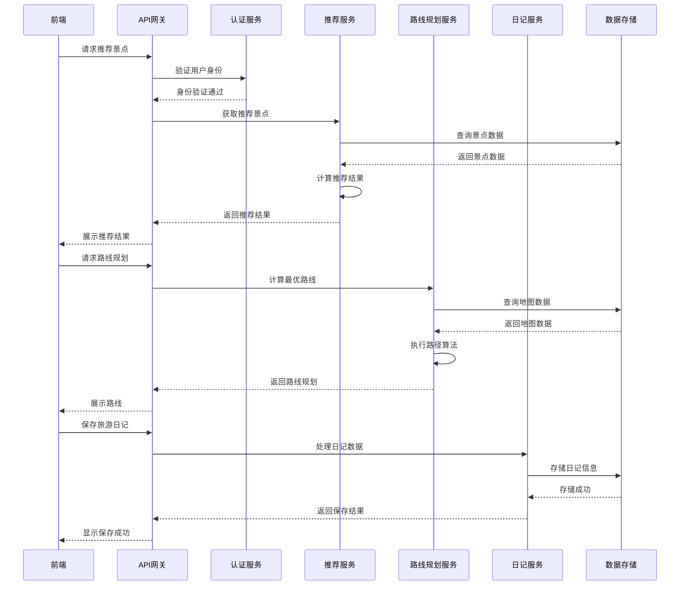

# 个性化旅游推荐系统技术设计文档

## 1. 系统架构设计

### 1.1 架构风格
采用前后端分离的三层架构：
- **前端层**：负责用户界面展示和交互
- **后端层**：负责业务逻辑处理和数据处理
- **数据层**：负责数据存储和管理

### 1.2 系统模块划分

| 模块名称 | 职责描述 | 所属层次 |
|---------|---------|----------|
| 前端应用 | 用户界面展示、交互处理 | 前端层 |
| API网关 | 请求路由、负载均衡 | 后端层 |
| 认证服务 | 用户认证、权限管理 | 后端层 |
| 旅游推荐服务 | 旅游目的地推荐、美食推荐 | 后端层 |
| 路线规划服务 | 最优路径计算、导航 | 后端层 |
| 场所查询服务 | 附近设施查找、信息查询 | 后端层 |
| 旅游日记服务 | 日记管理、交流、动画生成 | 后端层 |
| 数据存储服务 | 数据持久化、缓存管理 | 数据层 |

### 1.3 核心流程图

## 2. 技术栈选择

### 2.1 前端技术

| 技术 | 版本 | 用途 | 选型理由 |
|-----|------|------|----------|
| Vue.js | 3.x | 前端框架 | 响应式设计，组件化开发，适合构建复杂的用户界面 |
| Vue Router | 4.x | 路由管理 | 前端路由控制，实现单页应用 |
| Pinia | 2.x | 状态管理 | 轻量级状态管理，替代Vuex |
| Axios | 1.x | 网络请求 | 处理HTTP请求，与后端API通信 |
| Element Plus | 2.x | UI组件库 | 提供丰富的UI组件，加速开发 |
| Leaflet | 1.9.x | 地图库 | 轻量级开源地图库，支持离线地图 |
| ECharts | 5.x | 数据可视化 | 用于热度分析、数据统计等可视化展示 |

### 2.2 后端技术

| 技术 | 版本 | 用途 | 选型理由 |
|-----|------|------|----------|
| Java | 11 | 开发语言 | 成熟稳定，适合企业级应用开发 |
| Spring Boot | 2.7.x | 应用框架 | 简化后端开发，提供丰富的生态 |
| Spring Cloud | 2021.0.x | 微服务框架 | 支持服务注册与发现，负载均衡 |
| MyBatis-Plus | 3.5.x | ORM框架 | 简化数据库操作，提供代码生成 |
| MySQL | 8.0 | 关系型数据库 | 成熟稳定，适合存储结构化数据 |
| Redis | 7.0+ | 缓存 | 提高数据访问速度，减轻数据库压力 |
| Elasticsearch | 7.17+ | 搜索引擎 | 支持全文检索，提高查询效率 |

### 2.3 数据结构与算法

| 数据结构/算法 | 用途 | 选型理由 |
|---------------|------|----------|
| 图结构 | 道路网络建模 | 适合表示景点和道路之间的关系 |
| 优先队列 | 路径规划 | 用于Dijkstra算法实现最短路径 |
| 哈希表 | 快速查询 | 用于用户、景点等信息的快速检索 |
| 前缀树 | 模糊查询 | 用于美食、景点名称的模糊搜索 |
| 排序算法 | 推荐排序 | 用于景点、美食、日记的排序 |
| Dijkstra算法 | 最短路径 | 用于路线规划中的最短距离计算 |
| A*算法 | 路径规划 | 用于更高效的路径搜索 |
| 协同过滤 | 推荐算法 | 基于用户行为的个性化推荐 |

### 2.4 开发工具

| 工具 | 用途 | 选型理由 |
|-----|------|----------|
| IntelliJ IDEA | 后端开发 | 功能强大的Java IDE |
| VS Code | 前端开发 | 轻量级编辑器，丰富的插件生态 |
| Git | 版本控制 | 代码管理和协作 |
| Maven | 依赖管理 | 管理Java项目依赖 |
| npm | 包管理 | 管理前端项目依赖 |
| Jenkins | 持续集成 | 自动化构建和部署 |

## 3. 核心功能技术实现

### 3.1 旅游推荐功能
- **技术实现**：基于协同过滤和内容过滤的混合推荐算法
- **数据结构**：使用哈希表存储用户偏好，图结构存储景点关系
- **关键算法**：排序算法（Top-K排序）、相似度计算算法

### 3.2 路线规划功能
- **技术实现**：基于图论的路径规划算法
- **数据结构**：图结构（邻接表）存储道路网络
- **关键算法**：Dijkstra算法（最短距离）、A*算法（考虑启发式）

### 3.3 场所查询功能
- **技术实现**：基于地理位置的搜索
- **数据结构**：空间索引（R树或网格索引）
- **关键算法**：范围查询算法、排序算法

### 3.4 美食推荐功能
- **技术实现**：基于距离和评价的混合排序
- **数据结构**：哈希表存储美食信息，优先队列用于排序
- **关键算法**：Top-K排序算法、模糊匹配算法

### 3.5 旅游日记功能
- **技术实现**：基于文件系统和数据库的混合存储
- **数据结构**：树结构（目录树）、哈希表
- **关键算法**：全文检索算法、压缩算法

### 3.6 旅游动画生成
- **技术实现**：基于开源AIGC库的动画生成
- **数据结构**：图像和文本处理的数据结构
- **关键算法**：图像处理算法、动画生成算法

## 4. 数据库设计

### 4.1 核心数据表

| 表名 | 描述 | 主要字段 |
|-----|------|----------|
| users | 用户信息 | id, username, password, email, interests |
| attractions | 景点信息 | id, name, description, location, type, rating |
| campuses | 校园信息 | id, name, description, location |
| buildings | 建筑物信息 | id, name, type, location, parent_id |
| facilities | 服务设施 | id, name, type, location, description |
| roads | 道路信息 | id, start_id, end_id, distance, speed, congestion |
| foods | 美食信息 | id, name, cuisine, rating, price, location |
| restaurants | 饭店信息 | id, name, location, description |
| diaries | 旅游日记 | id, user_id, title, content, images, videos,热度 |
| comments | 评论信息 | id, user_id, target_id, target_type, content, rating |
| tags | 标签信息 | id, name, type |
| user_tags | 用户标签关联 | user_id, tag_id, weight |
| attraction_tags | 景点标签关联 | attraction_id, tag_id, weight |

### 4.2 数据存储策略
- **关系型数据**：存储在MySQL中
- **非结构化数据**：如图片、视频存储在文件系统或对象存储中
- **搜索数据**：同步到Elasticsearch中，支持全文检索
- **缓存数据**：热点数据存储在Redis中，提高访问速度

## 5. 部署与集成方案

### 5.1 部署架构
- **开发环境**：本地开发环境
- **测试环境**：独立的测试服务器
- **生产环境**：容器化部署（Docker）

### 5.2 集成方案
- **前端集成**：使用npm构建工具，生成静态文件
- **后端集成**：使用Maven构建，生成可执行jar包
- **API集成**：RESTful API接口，前后端通过HTTP通信
- **数据库集成**：使用MyBatis-Plus进行ORM映射

### 5.3 监控与维护
- **日志管理**：使用ELK stack收集和分析日志
- **性能监控**：使用Spring Boot Actuator监控系统状态
- **故障排查**：建立完善的错误处理和告警机制

## 6. 开发计划

### 6.1 项目阶段

| 阶段 | 时间 | 主要任务 |
|-----|------|----------|
| 需求分析 | 1周 | 需求文档编写和评审 |
| 架构设计 | 1周 | 技术架构设计和文档编写 |
| 前端开发 | 3周 | 前端界面和交互开发 |
| 后端开发 | 4周 | 后端服务和API开发 |
| 数据准备 | 2周 | 景点、道路等数据收集和处理 |
| 算法实现 | 2周 | 推荐算法、路径规划算法实现 |
| 测试调试 | 2周 | 系统测试和bug修复 |
| 部署上线 | 1周 | 系统部署和上线 |

### 6.2 关键里程碑
1. 需求文档完成
2. 技术架构设计完成
3. 核心功能模块开发完成
4. 算法实现完成
5. 系统测试通过
6. 系统部署上线

## 7. 技术风险与应对策略

| 风险 | 影响 | 应对策略 |
|-----|------|----------|
| 路径规划算法性能 | 路线计算时间过长 | 采用A*算法优化，使用缓存减少重复计算 |
| 推荐算法准确性 | 推荐结果不符合用户期望 | 结合多种推荐策略，持续优化算法 |
| 数据量增长 | 系统性能下降 | 数据库分表分库，使用缓存和搜索引擎 |
| 地图数据准确性 | 路线规划错误 | 定期更新地图数据，建立数据验证机制 |
| AIGC算法复杂度 | 动画生成时间过长 | 优化算法参数，考虑使用预训练模型 |

## 8. 技术选型理由

### 8.1 前端技术选型
- **Vue 3**：响应式设计，组件化开发，适合构建复杂的用户界面
- **Element Plus**：提供丰富的UI组件，加速开发
- **Leaflet**：轻量级开源地图库，支持离线地图，适合路线规划功能

### 8.2 后端技术选型
- **Spring Boot**：简化后端开发，提供丰富的生态
- **MyBatis-Plus**：简化数据库操作，提供代码生成
- **MySQL**：成熟稳定，适合存储结构化数据
- **Redis**：提高数据访问速度，减轻数据库压力
- **Elasticsearch**：支持全文检索，提高查询效率

### 8.3 数据结构与算法选型
- **图结构**：适合表示道路网络和景点关系
- **优先队列**：用于路径规划算法
- **哈希表**：用于快速查询
- **Dijkstra算法**：经典的最短路径算法
- **A*算法**：更高效的路径搜索算法

## 9. 扩展性考虑

### 9.1 功能扩展
- 支持多语言国际化
- 增加社交分享功能
- 集成第三方支付
- 支持多平台（Web、App）

### 9.2 技术扩展
- 引入微服务架构，提高系统可扩展性
- 使用容器化技术，简化部署和管理
- 引入机器学习模型，提高推荐准确性
- 支持实时数据处理，提供更及时的推荐

## 10. 结论

本技术设计方案基于需求文档和现有的技术经验，采用前后端分离的架构，使用Vue 3、Spring Boot、MySQL等技术栈，实现个性化旅游推荐系统的各项功能。系统设计考虑了可扩展性、性能和可靠性，为后续的开发和维护提供了良好的基础。

---

**文档作者**：架构师
**文档版本**：1.0
**创建日期**：2026-03-09
**最后更新**：2026-03-09